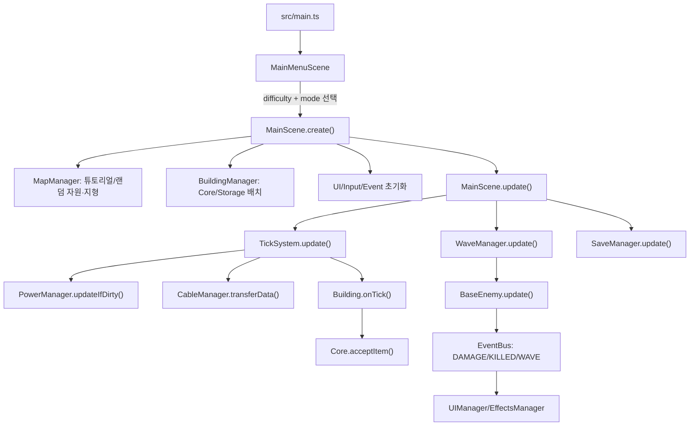

# 아키텍처

> 모바일 개발 상태: 현재 모바일 개발은 일시 중단 상태입니다. 모바일 관련 구현, QA, 레이아웃 개선, 터치 조작 개선은 개발 재개 전까지 보류합니다.

## 전체 구조 개요

Gradium은 Phaser Scene이 캔버스 런타임을 담당하고, DOM 기반 HUD/모달이 그 위에 겹쳐지는 구조입니다. `MainScene`은 public scene state, Phaser lifecycle, 입력/cursor proxy, frame update를 소유하고, `MainSceneBootstrap`이 매니저/맵/Core/초기 Storage bootstrap을, `MainSceneRuntimeEvents`가 EventBus runtime wiring과 wave result summary/shutdown cleanup을 담당합니다. 하위 시스템은 `EventBus`와 Scene 참조를 통해 느슨하게 연결됩니다. Preact는 DOM HUD overlay 이전용으로만 도입되었고, Phaser canvas와 게임 simulation 렌더링은 계속 Phaser가 담당합니다.

핵심 데이터는 `CONFIG`와 런타임 매니저 상태로 나뉩니다.

- 정적 설정: `src/config.ts`
- 타입 계약: `src/types.ts`
- 런타임 조립: `src/scenes/MainScene.ts`, `src/scenes/MainSceneBootstrap.ts`, `src/scenes/MainSceneRuntimeEvents.ts`
- 게임 객체: `src/buildings/*`, `src/enemies/BaseEnemy.ts`
- 캔버스 그래픽 팔레트: `src/visuals/visualTheme.ts`
- 순수 계산: `src/utils/*` (`gridPath`, `geometry`, 시뮬레이션/요약/마이그레이션)
- DOM UI: `src/ui/UIManager.ts`와 하위 UI controller/legacy helper, `index.html`, `src/styles/main.css`, `src/styles/legacy-ui.css`. 이전 `src/managers/UIManager.ts` re-export stub은 제거되었습니다.
- Preact HUD overlay: `src/ui/mountHud.tsx`, `src/ui/HudApp.tsx`, `src/ui/signals/*`, `src/ui/components/MainMenu.tsx`, `src/ui/components/TopBar.tsx`, `src/ui/components/RightRail.tsx`, `src/ui/components/BuildConsole.tsx`, `src/ui/components/SettingsModal.tsx`, `src/ui/components/ResearchPanel.tsx`, `src/ui/components/GameOverScreen.tsx`, `src/ui/components/WaveResultCard.tsx`, `src/ui/components/ActivityLog.tsx`, `src/ui/components/Tooltip.tsx`, `src/ui/components/TutorialPanel.tsx`, `src/ui/components/MobileActionBar.tsx`, `src/ui/shared/*`, `src/ui/UIManager.ts`, controller/display helpers, legacy fallback helpers, `src/ui/domEnvironment.ts`, `src/styles/tokens.css`

## 화면/UI 흐름

1. `MainMenuScene`이 메뉴 배경 그리드/파티클을 Phaser로 렌더링하고, 보이는 타이틀/난이도/설명/시작/이어하기 UI는 Preact MainMenu overlay가 표시합니다. 기존 canvas coordinate smoke를 위한 투명 Phaser Zone hit target은 `MainMenuScene` 내부 fallback으로만 생성하고 메뉴 텍스트는 만들지 않으며, `src/ui/mainMenuDisplay.ts`가 overlay snapshot과 localized aria label을 만듭니다. 저장 슬롯이 있으면 Preact 이어하기 버튼이 `loadSave` start request를 보내고, legacy gameplay HUD display 복원은 `src/ui/legacyHudDom.ts`에 위임한 뒤 `MainScene` 초기화 완료 후 기존 `SaveManager.loadGame()` 경로가 복원합니다.
2. 앱 시작 시 `src/main.ts`가 Phaser Game을 만든 뒤 `#preact-hud`에 Preact HUD overlay를 마운트하고, Playwright가 request 이벤트를 발행할 수 있도록 `window.__GRADIUM_EVENT_BUS__`를 노출합니다. `src/ui/signals/bridge.ts`는 menu/HUD/tactical/build/settings/research/game-over/wave-result/activity-log/tooltip/tutorial/mobile-action snapshot과 core/power/wave 이벤트를 Preact signals로 연결합니다. TopBar에는 Settings와 Research shortcut만 있으며, `ResearchPanel`은 단일 활성 연구, queue, 3종 research data balance, blocked data 상태를 표시합니다. Preact MainMenu/BuildConsole/Settings/Research/GameOver/WaveResult/Tooltip/Tutorial/Mobile surfaces는 request 이벤트만 발행하고 실제 적용은 각 controller와 Scene 경로가 처리합니다.
3. 시작 시 `MainScene`으로 전환하면 `MainSceneBootstrap`이 기존 순서대로 manager/controller를 생성하고 맵, Core, 초기 Storage를 배치합니다. 이어 `src/ui/UIManager.ts` 초기화가 `src/ui/legacyHudDom.ts`의 `ensureLegacyHudDom()`을 호출해 `#game-hud-shell`을 필요 시 생성하고, 그 안에 호환용 legacy top/right/build DOM IDs를 생성하며, settings/game-over/tooltip/activity/notification fallback roots도 런타임 생성합니다. 데스크톱에서는 `#top-hud`, `#hud-right-rail`, `#bottom-ui-container`, `#build-console`이 hidden shadow fallback이고 Preact TopBar/RightRail/BuildConsole이 실제 표면입니다.
4. `UIManager`가 기존 DOM 보장과 하위 UI controller 조립을 담당합니다. Legacy shell shadow sync, ESC fallback modal hide, speed button active sync, build hotkey routing은 `src/ui/HudShellController.ts`가 `src/ui/legacyHudDom.ts`/`src/ui/domEnvironment.ts` helper를 호출해 처리하고, static DOM translation과 language-triggered build/tactical/mobile refresh는 `src/ui/HudLocalizationController.ts`가 처리합니다. Top HUD resource/power/wave/timer/frame refresh handling and legacy/snapshot emission은 `src/ui/TopHudController.ts`, Top HUD localized labels/resource/power/wave/timer 표시 payload 조립은 `src/ui/topHudDisplay.ts`, Top HUD legacy stat mirror는 `src/ui/legacyTopHud.ts`, tactical event handling, objective/wave/power/defense render scheduling, and `TACTICAL_PANELS_UPDATED` emission은 `src/ui/TacticalPanelController.ts`, tactical labels/objective/wave/power/defense 표시 payload와 RightRail common display payload 조립은 `src/ui/tacticalPanelDisplay.ts`, tactical panel legacy DOM refs/update는 `src/ui/legacyTacticalPanels.ts`, build console category/tool/hotkey/refresh handling, dependent mobile/HUD refresh requests, legacy render/selection sync, and `BUILD_CONSOLE_UPDATED` emission은 `src/ui/BuildConsoleController.ts`, legacy build console DOM render/selection helper는 `src/ui/legacyBuildConsole.ts`, BuildConsole localized labels/snapshot/selected-tool legacy panel display payload 조립은 `src/ui/buildConsoleSnapshot.ts`, wave result localized labels/snapshot/card/log display payload 조립은 `src/ui/waveResultDisplay.ts`, game-over event/request handling, run summary, snapshot emit, legacy open/restart/stats coordination은 `src/ui/GameOverController.ts`, game-over localized labels/snapshot/stat line display payload 조립은 `src/ui/gameOverDisplay.ts`, tooltip open/close label/activity snapshot, desktop/mobile tooltip legacy mirror input, activity log localized labels/legacy entry, wave start/end 로그 표시 문구 조립은 `src/ui/notificationDisplay.ts`, wave start/end/result/tooltip/activity request handling and rolling log state는 `src/ui/NotificationController.ts`, mobile action/build summary refresh/status/cancel/rebuild handling과 cable menu close-on-selection은 `src/ui/MobileActionController.ts`, game-over legacy open/restart/stats DOM 반영은 `src/ui/legacyGameOver.ts`, wave result/log/tooltip의 legacy append/position/remove/hide는 `src/ui/legacyNotifications.ts`, mobile layout/canvas focus/pointer guard DOM environment는 `src/ui/domEnvironment.ts`가 처리하고, `index.html`은 Phaser mount, Preact root, 앱 script만 직접 제공합니다. BuildConsole의 category/item/hotkey snapshot source는 `buildConsoleSnapshot.ts` display state/payload이고 legacy fallback buttons도 같은 item view-model에서 label/cost/hotkey/active 값을 읽습니다. 이 UI controller들은 setup 시 owner listener를 재등록하고 Scene shutdown 때 자기 EventBus owner를 정리하므로 메뉴/scene 재시작 후 중복 HUD listener를 남기지 않습니다. `InputController`의 world hover tooltip은 `TOOLTIP_SHOW_REQUESTED`/`TOOLTIP_CLOSE_REQUESTED`로 들어와 같은 tooltip display path를 탑니다. Scene startup, save/load, tutorial lock change, training completion 및 E2E forced refresh가 필요한 build console refresh는 `BUILD_CONSOLE_REFRESH_REQUESTED`로 `BuildConsoleController`에 들어오며, BuildConsole render 후 mobile summary/action과 shell shadow refresh도 BuildConsoleController가 직접 request합니다. Mobile cable menu close는 `BUILDING_SELECTED`를 받은 `MobileActionController`의 선택 동기화 경로에서 처리됩니다. Tactical forced refresh는 `TACTICAL_PANELS_REFRESH_REQUESTED`로 들어옵니다. Language refresh는 `HudLocalizationController`가 `BUILD_CONSOLE_REFRESH_REQUESTED`/`MOBILE_UI_REBUILD_REQUESTED`/`TACTICAL_PANELS_REFRESH_REQUESTED`를 발행해 각 owner가 localized 표시 state를 다시 만듭니다. `MainSceneRuntimeEvents`의 wave-end summary 표시는 `WAVE_RESULT_SUMMARY_REQUESTED`, wave start/end activity feedback은 `WAVE_STARTED`/`WAVE_ENDED`, 건설/철거/오버레이 로그 표시는 `ACTIVITY_LOG_ENTRY_REQUESTED`로 들어와 같은 display path를 탑니다. Research unlock, tutorial step/complete, save/load/training 결과 로그도 `ACTIVITY_LOG_ENTRY_REQUESTED`로 들어옵니다. Top HUD labels, resource, power, wave-start/timer 표시는 `src/ui/topHudDisplay.ts`의 공통 display payload/snapshot helper를 통해 legacy mirror와 Preact snapshot이 같은 포맷을 쓴다.
5. 설정과 Research Panel UI는 각각 `SettingsController`, `ResearchPanelController`에 위임됩니다. `SettingsController`는 실제 설정 적용과 request 처리를 유지하고, `src/ui/settingsDisplay.ts`가 current settings state와 localized labels를 legacy input/open state와 Preact snapshot 공통 display payload로 변환합니다. `ResearchPanelController`는 `RESEARCH_OPEN_REQUESTED`, select/start request, `RESEARCH_STATE_CHANGED`를 받아 `ResearchManager.createPanelSnapshot()`을 발행합니다. 별도 연구 legacy modal은 없고, Research Operations Center를 world에서 클릭해도 Research Panel open request로 연결됩니다.
6. 모바일은 `MainScene.updateMobileLayoutState()`가 `src/ui/domEnvironment.ts`의 media query/body class helper로 layout 상태를 동기화하고, `MobileActionController`가 액션바/케이블 메뉴/빌드 요약 snapshot과 action/summary/refresh/status/cancel/rebuild request 처리를 갱신합니다. 이전 `src/managers/MobileUIManager.ts` re-export stub은 제거되었고, EventBus owner도 `MobileActionController`로 정리되었습니다. `InputController`는 케이블 endpoint/cancel 표시를 직접 UIManager method로 바꾸지 않고 `MOBILE_ACTION_STATUS_REQUESTED`/`MOBILE_ACTION_CANCEL_REQUESTED`를 발행하며, 케이블 조작 로그도 `ACTIVITY_LOG_ENTRY_REQUESTED`로 요청합니다. MainScene overlay toggle은 `MOBILE_ACTION_REFRESH_REQUESTED`로 mobile snapshot을 갱신하고, build console refresh 후 요약 동기화는 `MOBILE_BUILD_SUMMARY_REFRESH_REQUESTED`, language relabel/rebuild는 `MOBILE_UI_REBUILD_REQUESTED`로 들어옵니다. `src/ui/mobileActionDisplay.ts`가 selected tool/action/cable-menu state와 localized aria/menu labels를 legacy active/summary와 Preact snapshot 공통 display payload로 변환하고, legacy mobile action/cable/build-summary DOM 생성, active class, cable menu class mirror, shadow sync는 `src/ui/legacyMobileControls.ts`가 담당합니다. mobile/short-landscape 판정도 `src/ui/domEnvironment.ts`를 사용합니다. 일반 모바일 portrait에서는 Preact MobileActionBar/MobileBuildSummary와 Preact BuildConsole이 실제 표면이고 legacy mobile action/build DOM은 shadow 상태로 남습니다. Short landscape에서는 Preact mobile/build layer가 숨겨져 기존 DOM fallback이 계속 조작 표면입니다.

주의: Playwright 테스트가 DOM id와 일부 텍스트를 직접 확인합니다. `index.html`, `src/ui/UIManager.ts`, `main.css` 변경 시 `tests/e2e/app-smoke.spec.ts`를 같이 확인하세요.

## 주요 런타임 흐름

## 게임 루프

`MainScene.update(time, delta)`는 프레임마다 다음을 실행합니다.

- 커서 위치와 그리드 갱신
- `TickSystem.update(time)`로 고정 틱 처리
- `WaveManager.update(delta * gameSpeed)`로 웨이브/적 처리. 튜토리얼 중에는 FIRST_WAVE 이전까지 타이머를 동결하고, FIRST_WAVE 단계에서 북쪽 gate mock wave를 시작합니다. 적 이동 target은 Core footprint center를 사용하고, next-wave briefing은 wave/difficulty 변경 시에만 발행하며, countdown 숫자는 `WAVE_UPDATE`로 갱신합니다. 타워의 적 range query는 `WaveManager`의 spatial bucket index를 사용합니다.
- `SaveManager.update(delta)`로 자동 저장
- `UI_FRAME_REFRESH_REQUESTED`로 HUD/패널 갱신 요청
- `CameraController.update()`로 카메라 이동
- `CableManager.drawCables()`와 이펙트 갱신
- dirty flag가 켜진 전력/방어 오버레이 재그리기

커서 ghost와 tooltip은 `InputController`가 snapped tile/tool/rotation/state signature로 dirty 갱신합니다. 같은 타일에서 상태가 바뀌지 않으면 ghost graphics와 tooltip DOM 문자열을 매 프레임 다시 만들지 않습니다.

## 캔버스 그래픽 방향

인게임 캔버스는 `src/visuals/visualTheme.ts`의 차가운 데이터 센터/침입 경보 팔레트를 공유합니다. `GridRenderer`는 어두운 배경, 섹터 그리드, 자원 패치, BLOCKER 지형을 `CONFIG.OPTIMIZATION.GRID_CHUNK_TILES` 단위 청크 텍스처로 캐시하고, 카메라 pan 중에는 기존 청크 이미지를 재사용합니다. `BaseBuilding`은 공통 정적 바디를 타입/크기/색상별 텍스처로 한 번 생성해 재사용하고, HP/감염/subclass 장식은 별도 그래픽으로 유지합니다. `BaseEnemy`, `CableManager`, `ItemManager`, `EffectsManager`, `OverlayController`, `InputController`가 같은 의미 색상을 재사용합니다. 건물은 PNG 텍스처를 preload하지 않고 코드 기반 패널/아이콘 렌더를 사용해 배경과 톤을 맞춥니다.

그래픽 패치는 gameplay 수치와 분리되어야 합니다. `src/config.ts`의 `COLOR` 값은 빌드 버튼 swatch와 건물 렌더 색으로도 쓰이므로, 색 변경은 허용되지만 HP/속도/비용/해금 조건과 섞어 수정하지 않는 것이 안전합니다.

`TickSystem` 내부에서는 매 틱마다 케이블 전송을 처리하고, 짝수 tick마다 AP 연결 갱신과 건물 `onTick()` 생산/가공을 수행합니다. 전력망은 건물 배치/삭제/파괴/연구 해금 등으로 dirty 처리된 경우에만 `PowerManager.updateIfDirty()`가 실제 rebuild를 수행합니다.

전력망 범위를 제외한 웨이브 적 target, 경로 가이드 라인처럼 멀티타일 건물의 기준점이 필요한 계산은 `src/utils/geometry.ts`의 footprint center를 공유합니다. Core 같은 4x4 건물은 전력 범위는 건물 테두리(footprint edges)를 기준으로 뻗어나가며, 적 경로는 중심 좌표를 기준으로 맞춰집니다.

`PerformanceStats`는 최근 frame samples, 주요 최적화 counter, entity count를 수집합니다. 런타임에서는 `scene.performanceStats.getSummary()`로 읽고, Playwright와 수동 디버깅에서는 `window.__GRADIUM_PERF__`로 접근합니다.

## 상태 관리 구조

상태 저장 위치는 다음처럼 분산되어 있습니다.

| 상태 | 위치 |
|---|---|
| 건물 목록 | `BuildingManager.buildings: Map<string, BaseBuilding>`, 타입별 index |
| 아이템 목록 | `ItemManager.items` |
| 케이블/큐 | `CableManager.cables`, `CableManager.apConnections` |
| 전력망 | `PowerManager.networks`, `buildingNetworkMap`, 각 건물 `hasPower`, `powerEfficiency` |
| 웨이브/적 | `WaveManager.currentWave`, `enemies`, timer/counter |
| Core 수신/HP | `Core.totalDataReceived`, `hp` |
| 연구 | `ResearchManager`의 completed set, `activeResearch`, `researchQueue`, 3종 research data store, progress |
| 방어 보정 | 완료 연구 효과(`ResearchManager.getEffectValue`)와 `CONFIG.BUILDINGS.*.DEFENSE` |
| UI 선택/모달 | `src/ui/UIManager.ts`, Preact components, 하위 UI controllers/signals |
| 튜토리얼 진행/실행 모드/맵 타입 | `TutorialManager`, `MainScene.mode`, `localStorage.gradium_tutorial_*`, `MapManager.mapType` |
| 저장 데이터 | `localStorage.gradium_save` |

전역 상태 저장소는 없고, `MainScene`이 매니저들을 직접 들고 있습니다. 순수 로직은 `utils`로 분리되어 테스트됩니다.

## 전력/연구 현재 구조

- 전력망은 더 이상 부족분을 즉시 전체 정지로만 처리하지 않습니다. `PowerManager`가 네트워크별 `satisfaction`을 계산하고 각 소비 건물에 `powerEfficiency`를 주입합니다. 생산/처리/방어/네트워크/연구 관련 건물은 이 효율로 작업 속도나 처리량을 낮춥니다.
- 독립 연구 시스템은 `ResearchManager`가 단일 활성 연구, queue, 3종 research data store(`material`, `tactical`, `system`)를 관리합니다. 연구 시설은 연구를 직접 맡지 않고 research data를 생산하며, 활성 연구가 매 tick data와 throughput을 소비합니다.
- `Research Lab`은 `MATERIAL_SAMPLE`을 material data로, `NeuralTrainer`는 `WEIGHT_UPDATE`를 tactical data로, `Data Center`는 시스템 작동 로그를 system data로 전환합니다. Research Operations Center(`RESEARCH_OPERATIONS_CENTER`, `ResearchOperationsCenter`)는 전역 research throughput을 올리고, 인접 powered GPU Cluster는 해당 기여도를 강화합니다.
- Preact `ResearchPanel`은 TopBar research shortcut에서 열리는 유일한 연구 조작 표면입니다.

## 데이터/config 로딩 흐름

- `CONFIG.BUILDINGS`는 건물 크기, 비용, 전력, HP, 생산률, 방어 수치, 해금 조건을 정의합니다.
- `CONFIG.RECIPES`는 `AbstractProcessor` 계열이 사용하는 입력/출력/시간입니다.
- `CONFIG.ENEMIES`, `CONFIG.DIFFICULTY`는 `WaveManager`와 `waveSimulation`이 사용합니다.
- `CONFIG.RESEARCH_AXES`, `CONFIG.RESEARCH_SETTINGS`, `CONFIG.RESEARCH`는 방사형 연구 축, research data capacity/output(`DATA_OUTPUT` material/tactical/system 1/1/1), throughput, 연구 노드 비용/해금/효과를 정의합니다. `ResearchManager.getEffectValue()`는 완료 연구의 수치 효과 facade를 제공합니다.
- `CONFIG.CABLES`와 `CONFIG.ACCESS_POINT`는 `CableManager`, `AccessPoint`, UI 입력 로직이 공유합니다. 케이블은 `COST_PER_TILE`, `MAX_LENGTH_TILES`, bandwidth, queue를 갖고, `TECH_DISTRIBUTED_AP`의 연구 효과가 bandwidth와 length를 보정합니다.

새 config 키를 추가하면 타입, 팩토리, i18n, UI, 테스트까지 연결되는지 확인해야 합니다.

## 맵 생성 정책

맵 생성은 장기적으로 `MapManager.generateMap({ presetId, seed? })`를 중심 API로 두고, 기존 `generateResourcePatches()`와 `generateTutorialMap()`은 호출부 호환을 위한 wrapper로 유지합니다.

- 캠페인/standard preset은 고정 장벽과 seed 기반 자원 분배를 조합합니다. seed가 없으면 `generateMap` 호출 시 새로 만들고, 실제 사용한 `presetId + seed`를 런타임과 저장 데이터에 남겨 같은 맵을 재현할 수 있게 합니다.
- 시작 자원은 고정 좌표가 아니라 preset의 starter zone 안에서 seed로 배치합니다. 패치 전체가 zone 안에 들어가야 하며, 자원끼리 겹치면 나중에 배치한 자원이 덮어씁니다.
- random resource가 starter resource 일부를 덮는 것은 허용합니다. 최종 cleanup에서 core/reserved/blocker 타일 위 자원은 삭제합니다.
- 공정성 검증은 시작 반경 안 필수 자원 수량만 확인합니다. 부족하면 CONFIG 순서대로 starter zone에 패치 단위 보정을 반복하고, 보정도 기존 자원을 덮어씁니다.
- standard terrain layout은 enemy route 시작점에서 Core 중심까지 tile 기반 예약 lane을 먼저 만들고, outer boundary terrain pass가 불규칙한 외곽 cave/rock mass를 형성합니다. 그 뒤 BLOCKER blob/rough line/cluster는 예약 영역과 fixed resource를 피해서 lane-side terrain과 expansion pocket을 채웁니다. 생성 후 긴 직선과 작은 파편을 정리하고, BFS가 실패하면 해당 lane 주변 blocker만 좁게 삭제해 적 이동 경로를 복구합니다.
- standard resource patch는 square tile block 대신 dense center와 불규칙 edge를 가진 organic blob으로 배치합니다. tutorial preset은 seed 없는 고정 사각 자원/장벽을 유지합니다.
- 다음 standard 맵 방향은 Mindustry-style region pass입니다. 현재 helper 경계는 `reservedEnemyPathTiles`를 corridor contract로 유지하면서 terrain region layer, lane-side shaping, ore vein/resource blob layer, tiny fragment cleanup을 순서대로 끼울 수 있게 둡니다.
- tutorial preset은 같은 생성 시스템 안에 두되 seed 기반 자원 분배를 끄고 완전 고정 자원/장벽을 유지합니다.
- standard preset은 큰 유한 작전 구역입니다. `WORLD_BOUNDS`/`BUILD_BOUNDS`는 `-64..64`, 랜덤 자원은 `RESOURCE_BOUNDS` `-60..60` 안에 생성됩니다. `CameraController`는 preset camera padding을 포함한 bounds로 스크롤을 clamp하고, `MainScene.isBlocked()`는 build bounds 밖 배치를 차단합니다.

## 케이블/Repeater 정책

케이블 배치 검증은 `CableManager.canConnect()`가 단일 경로입니다. UI preview와 실제 연결은 같은 결과를 사용합니다.

- endpoint 사이 자유각 직선 연결만 허용합니다.
- 거리는 endpoint 중심 간 Euclidean 거리의 tile ceil 값입니다.
- 설치 비용은 `distanceTiles * COST_PER_TILE`입니다.
- 제거 모드로 케이블을 제거하면 저장된 `costPaid`의 50%를 Silicon으로 환불합니다.
- `MAX_LENGTH_TILES + CABLE_LENGTH_BONUS`를 넘으면 연결할 수 없습니다.
- `src/utils/cablePath.ts`가 선분이 닿는 tile을 샘플링하고, `BLOCKER` 지형을 통과하면 연결을 거부합니다.
- 일반 건물 tile은 케이블을 막지 않습니다.
- `REPEATER`는 전력을 요구하는 무버퍼 유선 endpoint입니다. packet이 powered Repeater에 도착하면 `CableManager`가 다른 연결 cable로 넘기고, 넘길 경로가 없으면 packet은 incoming cable queue에 남습니다.
- `ACCESS_POINT`는 기존 무선 session relay 역할을 유지합니다.

## 저장/불러오기 흐름

`SaveManager.saveGame()`은 캠페인 모드에서만 다음을 `SaveData` 형태로 모아 localStorage에 저장합니다. 튜토리얼 모드는 학습용 임시 시나리오라 일반 캠페인 저장 슬롯을 덮어쓰지 않습니다. 자동 저장은 dirty gate를 거치며, 저장 이후 변경이 없고 wave/enemy/item/cable queue 같은 volatile state가 없으면 interval마다 전체 JSON 생성을 반복하지 않습니다. 필요한 자동 저장은 즉시 전체 snapshot을 만들지 않고 다음 macrotask로 예약한 뒤 buildings/items/cables/enemies/resource/terrain 배열 수집을 chunk 단위로 나눠 실행합니다. 저장/자동저장/로드 결과 표시는 `ACTIVITY_LOG_ENTRY_REQUESTED`로 activity display path에 요청합니다.

- wave 상태와 적 목록
- Core HP/점수
- 건물 위치/회전/버퍼/HP/customState
- 필드 아이템
- 케이블과 큐, 각 케이블의 `costPaid`
- 설정: 속도, 오버레이, 난이도, 언어, 사운드, 튜토리얼, 맵 타입, 맵 preset/seed
- 자원/지형 맵
- 연구 상태: 완료 연구, activeResearch, researchQueue, 진행도, dataStore, queueLimit

`SaveManager.loadGame()`은 `migrateSaveData()`로 기본값을 보정한 뒤 기존 Phaser 객체를 정리하고, 저장된 resource/terrain map과 `settings.mapType`을 복원한 다음 Core/연구/방어모델/건물/아이템/케이블/웨이브/설정을 재생성합니다. 저장된 active wave 적은 현재 wave HP 배율과 난이도 HP 배율을 합친 effective multiplier로 max HP를 복원하고, 저장 HP를 그 범위로 clamp합니다.

저장 포맷 변경 시 해야 할 일:

1. `src/types.ts`의 `SaveData` 계열 갱신
2. `src/managers/SaveManager.ts` 저장/로드 반영
3. `src/utils/saveMigration.ts` 기본값/버전 처리
4. `src/utils/saveMigration.test.ts` 추가

## 주요 모듈 관계

- `MainScene` -> Scene lifecycle, public state, input/cursor proxy, frame update
- `MainSceneBootstrap` -> manager/controller 생성, 맵/Core/초기 Storage 배치, tutorial/save bootstrap
- `MainSceneRuntimeEvents` -> BUILDING/POWER/WAVE EventBus wiring, wave result summary, shutdown owner cleanup
- `BuildingManager` -> `BuildingFactory` -> `buildings/*`
- `TickSystem` -> `PowerManager`, `CableManager`, `BaseBuilding.onTick()`
- `WaveManager` -> `waveSimulation`, `waveBriefingKey`, `geometry`, `BaseEnemy`
- `BaseEnemy` -> `gridPath`, `enemyBuildingInteraction`, `BuildingManager`, `MapManager`
- `PerformanceStats` -> `MainScene`과 주요 manager counter
- `CableManager` -> `apRelay`, `AccessPoint`, 건물 버퍼
- `UIManager` -> legacy DOM 보장, `TopHudController`/`TacticalPanelController`/`BuildConsoleController`/`SettingsController`/`ResearchPanelController`/`MobileActionController`/`NotificationController`/`GameOverController` 조립
- `ResearchManager` -> `CONFIG.RESEARCH`, 단일 활성 연구, queue, research data store, ROC/GPU throughput 보너스, 완료 효과 facade
- `SaveManager` -> 거의 모든 manager + `saveMigration`, `enemyRestore`
- `tutorialFlow` -> 건물 역할 튜토리얼 단계/허용 건물/추천 도구/완료 메타/월드 시각 힌트 데이터, `TutorialManager`가 이를 렌더링하고 생산/전력/케이블 시작점/정확한 케이블 연결/웨이브/ROC 배치 조건을 확인합니다. 완료/스킵 시에는 완료 패널 snapshot을 발행하고, `TUTORIAL_CAMPAIGN_START_REQUESTED` 후 새 캠페인 랜덤 맵으로 전환합니다.
- `ResearchOperationsCenter` -> internal building ID `RESEARCH_OPERATIONS_CENTER`, player-facing Research Operations Center로 동작하며, powered 상태에서 전역 research throughput을 올림
- `GPU_CLUSTER` -> powered adjacent Research Operations Center의 throughput 기여도를 강화

## 신규 기능 추가 위치와 일반 절차

### 새 건물

1. `src/config.ts`에 `CONFIG.BUILDINGS` 항목 추가
2. `src/types.ts`의 `BuildingType` 갱신
3. `src/buildings/`에 클래스 추가 또는 기존 기반 클래스 확장
4. `src/buildings/BuildingFactory.ts` registry에 등록
5. `src/i18n.ts`에 건물명/설명 키 추가
6. `BaseBuilding.drawBody()`의 코드 기반 식별 표시가 필요한지 확인
7. UI 카테고리/해금/비용이 맞는지 `BuildConsoleController`, `buildConsoleSnapshot`, `progressionGates` 확인
8. `src/config.test.ts`와 관련 유닛/E2E 추가

### 새 자원/아이템/레시피

1. `CONFIG.ITEMS`와 `CONFIG.RECIPES` 갱신
2. 생산/소비 건물의 `canAcceptItem`, `onTick`, `getOutputSource` 확인
3. 케이블 데이터 아이템이면 `CableManager.DATA_ITEMS`, AP 정책, DataCache 허용 목록 확인
4. research data 생산이면 `ResearchManager.depositData()` 호출과 `CONFIG.RESEARCH_SETTINGS.DATA_OUTPUT` 반영 확인
5. 순수 시뮬레이션 테스트 추가

### 새 적/웨이브 규칙

1. `CONFIG.ENEMIES` 수치 추가
2. `WaveManager.spawnEnemy()`와 `BaseEnemy` 특수 효과/시각 갱신
3. 이동/pathfinding 규칙이면 `utils/gridPath.ts`, `utils/geometry.ts`, `BaseEnemy.getMoveTarget()` fallback을 함께 확인
4. `utils/waveSimulation.ts`에 수량/브리핑/추정 HP 반영
5. `waveSimulation.test.ts`, `gridPath.test.ts`, 필요하면 E2E threat panel 갱신

### 새 저장 상태

1. 타입 -> 저장 -> 로드 -> 마이그레이션 -> 테스트 순서로 추가
2. Phaser 객체 cleanup이 필요한 상태라면 `loadGame()`의 기존 상태 정리 구간도 확인

### 새 UI/조작

1. Preact 표면은 `src/ui/components/*`와 display helper에서 설계하고, legacy fallback id/class는 `legacy*` helper에서 보존
2. 실제 적용/선택 로직은 `src/ui/*Controller.ts` 또는 EventBus request 경로에 배치
3. 캔버스 포인터와 충돌하면 `InputController.isPointerOverDomUI()` guard 추가
4. 데스크톱/모바일 Playwright smoke 추가
