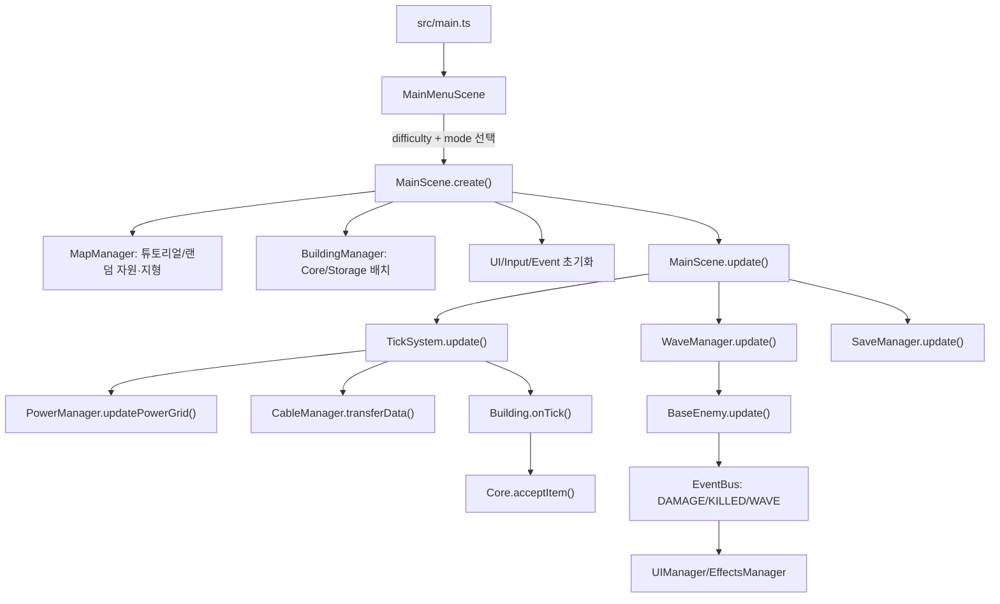

# 아키텍처

## 전체 구조 개요

Gradium은 Phaser Scene이 캔버스 런타임을 담당하고, DOM 기반 HUD/모달이 그 위에 겹쳐지는 구조입니다. `MainScene`이 매니저들을 직접 생성해 소유하며, 하위 시스템은 `EventBus`와 Scene 참조를 통해 느슨하게 연결됩니다.

핵심 데이터는 `CONFIG`와 런타임 매니저 상태로 나뉩니다.

- 정적 설정: `src/config.ts`
- 타입 계약: `src/types.ts`
- 런타임 조립: `src/scenes/MainScene.ts`
- 게임 객체: `src/buildings/*`, `src/enemies/BaseEnemy.ts`
- 캔버스 그래픽 팔레트: `src/visuals/visualTheme.ts`
- 순수 계산: `src/utils/*` (`gridPath`, `geometry`, 시뮬레이션/요약/마이그레이션)
- DOM UI: `src/managers/UIManager.ts`와 하위 UI 매니저, `index.html`, `src/styles/main.css`

## 화면/UI 흐름

1. `MainMenuScene`이 타이틀, 난이도 버튼, 시작 버튼을 Phaser 텍스트로 렌더링합니다.
2. 시작 시 `MainScene`으로 전환하면서 `#game-hud-shell` 안의 `#top-hud`, `#info-layer`, `#bottom-ui-container` DOM 영역을 표시합니다.
3. `UIManager`가 상단 상태바, 우측 목표/위협/시스템 레일, 하단 빌드 콘솔, 선택 도구 요약, 툴팁, 로그, 게임오버를 제어합니다.
4. 설정과 Neural Operations Lab UI는 각각 `SettingsUI`, `TrainingLabUI`에 위임됩니다. `ResearchUI`는 레거시 연구 모달을 숨기는 호환 no-op입니다.
5. 모바일은 `MainScene.updateMobileLayoutState()`가 body class를 토글하고, `MobileUIManager`가 액션바/케이블 메뉴/빌드 요약을 갱신합니다. 모바일에서는 HUD 표면이 터치 배치를 가로막지 않도록 pointer-events가 제한됩니다.

주의: Playwright 테스트가 DOM id와 일부 텍스트를 직접 확인합니다. `index.html`, `UIManager`, `main.css` 변경 시 `tests/e2e/app-smoke.spec.ts`를 같이 확인하세요.

## 주요 런타임 흐름

## 게임 루프

`MainScene.update(time, delta)`는 프레임마다 다음을 실행합니다.

- 커서 위치와 그리드 갱신
- `TickSystem.update(time)`로 고정 틱 처리
- `WaveManager.update(delta * gameSpeed)`로 웨이브/적 처리. 튜토리얼 중에는 FIRST_WAVE 이전까지 타이머를 동결하고, FIRST_WAVE 단계에서 북쪽 gate mock wave를 시작합니다. 적 이동 target은 Core footprint center를 사용하고, next-wave briefing은 wave/difficulty 변경 시에만 발행하며, countdown 숫자는 `WAVE_UPDATE`로 갱신합니다.
- `SaveManager.update(delta)`로 자동 저장
- `UIManager.update()`로 HUD/패널 갱신
- `CameraController.update()`로 카메라 이동
- `CableManager.drawCables()`와 이펙트 갱신
- dirty flag가 켜진 전력/방어 오버레이 재그리기

## 캔버스 그래픽 방향

인게임 캔버스는 `src/visuals/visualTheme.ts`의 차가운 데이터 센터/침입 경보 팔레트를 공유합니다. `GridRenderer`는 어두운 배경, 섹터 그리드, 자원 패치, BLOCKER 지형을 `CONFIG.OPTIMIZATION.GRID_CHUNK_TILES` 단위 청크 텍스처로 캐시하고, 카메라 pan 중에는 기존 청크 이미지를 재사용합니다. `BaseBuilding`은 공통 정적 바디를 타입/크기/색상별 텍스처로 한 번 생성해 재사용하고, HP/감염/subclass 장식은 별도 그래픽으로 유지합니다. `BaseEnemy`, `CableManager`, `ItemManager`, `EffectsManager`, `OverlayController`, `InputController`가 같은 의미 색상을 재사용합니다. 건물은 PNG 텍스처를 preload하지 않고 코드 기반 패널/아이콘 렌더를 사용해 배경과 톤을 맞춥니다.

그래픽 패치는 gameplay 수치와 분리되어야 합니다. `src/config.ts`의 `COLOR` 값은 빌드 버튼 swatch와 건물 렌더 색으로도 쓰이므로, 색 변경은 허용되지만 HP/속도/비용/해금 조건과 섞어 수정하지 않는 것이 안전합니다.

`TickSystem` 내부에서는 매 틱마다 케이블 전송을 처리하고, 짝수 tick마다 전력망 갱신, AP 연결 갱신, 건물 `onTick()` 생산/가공을 수행합니다.

전력망 범위를 제외한 웨이브 적 target, 경로 가이드 라인처럼 멀티타일 건물의 기준점이 필요한 계산은 `src/utils/geometry.ts`의 footprint center를 공유합니다. Core 같은 4x4 건물은 전력 범위는 건물 테두리(footprint edges)를 기준으로 뻗어나가며, 적 경로는 중심 좌표를 기준으로 맞춰집니다.

## 상태 관리 구조

상태 저장 위치는 다음처럼 분산되어 있습니다.

| 상태 | 위치 |
|---|---|
| 건물 목록 | `BuildingManager.buildings: Map<string, BaseBuilding>` |
| 아이템 목록 | `ItemManager.items` |
| 케이블/큐 | `CableManager.cables`, `CableManager.apConnections` |
| 전력망 | `PowerManager.networks`, `buildingNetworkMap`, 각 건물 `hasPower` |
| 웨이브/적 | `WaveManager.currentWave`, `enemies`, timer/counter |
| Core 수신/HP | `Core.totalDataReceived`, `hp` |
| 시스템 프로토콜 | `ResearchManager.unlockedResearch`, `ResearchManager.jobProgress` |
| 방어 모델 | `MainScene.defenseModelStates` (`modelAccuracy`, `damageBonus`, 누적 학습 데이터, 학습 진행 상태) |
| UI 선택/모달 | `UIManager`와 하위 UI 매니저 |
| 튜토리얼 진행/실행 모드/맵 타입 | `TutorialManager`, `MainScene.mode`, `localStorage.gradium_tutorial_*`, `MapManager.mapType` |
| 저장 데이터 | `localStorage.gradium_save` |

전역 상태 저장소는 없고, `MainScene`이 매니저들을 직접 들고 있습니다. 순수 로직은 `utils`로 분리되어 테스트됩니다.

## 데이터/config 로딩 흐름

- `CONFIG.BUILDINGS`는 건물 크기, 비용, 전력, HP, 생산률, 방어 수치, 해금 조건을 정의합니다.
- `CONFIG.RECIPES`는 `AbstractProcessor` 계열이 사용하는 입력/출력/시간입니다.
- `CONFIG.ENEMIES`, `CONFIG.DIFFICULTY`는 `WaveManager`와 `waveSimulation`이 사용합니다.
- `CONFIG.RESEARCH`는 시스템 프로토콜 필요 진행도, 선행 조건, 해금, 효과를 정의하고 `ResearchManager.getEffectValue()`가 누적합니다. 진행도는 Neural Operations Lab이 데이터 아이템을 소비해 올립니다.
- `CONFIG.CABLES`와 `CONFIG.ACCESS_POINT`는 `CableManager`, `AccessPoint`, UI 입력 로직이 공유합니다. 케이블은 `COST_PER_TILE`, `MAX_LENGTH_TILES`, bandwidth, queue를 갖고, `TECH_DISTRIBUTED_AP`의 연구 효과가 bandwidth와 length를 보정합니다.

새 config 키를 추가하면 타입, 팩토리, i18n, UI, 테스트까지 연결되는지 확인해야 합니다.

## 맵 생성 정책

맵 생성은 장기적으로 `MapManager.generateMap({ presetId, seed? })`를 중심 API로 두고, 기존 `generateResourcePatches()`와 `generateTutorialMap()`은 호출부 호환을 위한 wrapper로 유지합니다.

- 캠페인/standard preset은 고정 장벽과 seed 기반 자원 분배를 조합합니다. seed가 없으면 `generateMap` 호출 시 새로 만들고, 실제 사용한 `presetId + seed`를 런타임과 저장 데이터에 남겨 같은 맵을 재현할 수 있게 합니다.
- 시작 자원은 고정 좌표가 아니라 preset의 starter zone 안에서 seed로 배치합니다. 패치 전체가 zone 안에 들어가야 하며, 자원끼리 겹치면 나중에 배치한 자원이 덮어씁니다.
- random resource가 starter resource 일부를 덮는 것은 허용합니다. 최종 cleanup에서 core/reserved/blocker 타일 위 자원은 삭제합니다.
- 공정성 검증은 시작 반경 안 필수 자원 수량만 확인합니다. 부족하면 CONFIG 순서대로 starter zone에 패치 단위 보정을 반복하고, 보정도 기존 자원을 덮어씁니다.
- tutorial preset은 같은 생성 시스템 안에 두되 seed 기반 자원 분배를 끄고 완전 고정 자원/장벽을 유지합니다.
- standard preset은 큰 유한 작전 구역입니다. `WORLD_BOUNDS`/`BUILD_BOUNDS`는 `-64..64`, 랜덤 자원은 `RESOURCE_BOUNDS` `-56..56` 안에 생성됩니다. `CameraController`는 preset camera padding을 포함한 bounds로 스크롤을 clamp하고, `MainScene.isBlocked()`는 build bounds 밖 배치를 차단합니다.

## 케이블/Repeater 정책

케이블 배치 검증은 `CableManager.canConnect()`가 단일 경로입니다. UI preview와 실제 연결은 같은 결과를 사용합니다.

- endpoint 사이 자유각 직선 연결만 허용합니다.
- 거리는 endpoint 중심 간 Euclidean 거리의 tile ceil 값입니다.
- 설치 비용은 `distanceTiles * COST_PER_TILE`입니다.
- 제거 모드로 케이블을 제거하면 저장된 `costPaid`의 50%를 Silicon으로 환불합니다.
- `MAX_LENGTH_TILES + CABLE_LENGTH_BONUS`를 넘으면 연결할 수 없습니다.
- `src/utils/cablePath.ts`가 선분이 닿는 tile을 샘플링하고, `BLOCKER` 지형을 통과하면 연결을 거부합니다.
- 일반 건물 tile은 케이블을 막지 않습니다.
- `REPEATER`는 전력을 요구하는 무버퍼 유선 endpoint입니다. packet이 powered Repeater에 도착하면 `CableManager`가 다른 연결 cable로 넘기고, 넘길 경로가 없으면 packet은 incoming cable queue에 남습니다.
- `ACCESS_POINT`는 기존 무선 session relay 역할을 유지합니다.

## 저장/불러오기 흐름

`SaveManager.saveGame()`은 캠페인 모드에서만 다음을 `SaveData` 형태로 모아 localStorage에 저장합니다. 튜토리얼 모드는 학습용 임시 시나리오라 일반 캠페인 저장 슬롯을 덮어쓰지 않습니다.

- wave 상태와 적 목록
- Core HP/점수
- 건물 위치/회전/버퍼/HP/customState
- 방어 모델 공유 상태와 모델 학습 진행 상태
- 필드 아이템
- 케이블과 큐, 각 케이블의 `costPaid`
- 설정: 속도, 오버레이, 난이도, 언어, 사운드, 튜토리얼, 맵 타입, 맵 preset/seed
- 자원/지형 맵
- 연구 해금 목록

`SaveManager.loadGame()`은 `migrateSaveData()`로 기본값을 보정한 뒤 기존 Phaser 객체를 정리하고, 저장된 resource/terrain map과 `settings.mapType`을 복원한 다음 Core/연구/방어모델/건물/아이템/케이블/웨이브/설정을 재생성합니다. 저장된 active wave 적은 현재 wave HP 배율과 난이도 HP 배율을 합친 effective multiplier로 max HP를 복원하고, 저장 HP를 그 범위로 clamp합니다.

저장 포맷 변경 시 해야 할 일:

1. `src/types.ts`의 `SaveData` 계열 갱신
2. `src/managers/SaveManager.ts` 저장/로드 반영
3. `src/utils/saveMigration.ts` 기본값/버전 처리
4. `src/utils/saveMigration.test.ts` 추가

## 주요 모듈 관계

- `MainScene` -> 모든 manager 생성과 Scene lifecycle 관리
- `BuildingManager` -> `BuildingFactory` -> `buildings/*`
- `TickSystem` -> `PowerManager`, `CableManager`, `BaseBuilding.onTick()`
- `WaveManager` -> `waveSimulation`, `waveBriefingKey`, `geometry`, `BaseEnemy`
- `BaseEnemy` -> `gridPath`, `enemyBuildingInteraction`, `BuildingManager`, `MapManager`
- `CableManager` -> `apRelay`, `AccessPoint`, 건물 버퍼
- `UIManager` -> `progressionGates`, `waveSimulation`, `runResultSummary`, 하위 UI managers
- `ResearchManager` -> `CONFIG.RESEARCH`, Lab job progress
- `SaveManager` -> 거의 모든 manager + `saveMigration`, `enemyRestore`
- `tutorialFlow` -> 건물 역할 튜토리얼 단계/허용 건물/완료 메타/월드 시각 힌트 데이터, `TutorialManager`가 이를 렌더링하고 생산/전력/케이블/웨이브/모델 대상 조건을 확인한 뒤 완료/스킵 시 새 캠페인 랜덤 맵으로 전환
- `ModelTrainingLab` -> RAW/LABELED/WEIGHT 데이터를 방어 모델 또는 시스템 프로토콜 작업에 투입하고, 방어 모델 학습 시간 완료 시 정확도 또는 공격력 보너스를 올리며, `MODEL_TRAINING_TARGET_SET` 이벤트로 튜토리얼 최종 Lab 단계와 연결
- `GPU_CLUSTER` -> Research와 무관하게 아무 방어 모델 하나가 정확도 100%에 도달하면 빌드 UI에 노출되며, powered adjacent GPU가 `ModelTrainingLab` 학습 시간을 줄임

## 신규 기능 추가 위치와 일반 절차

### 새 건물

1. `src/config.ts`에 `CONFIG.BUILDINGS` 항목 추가
2. `src/types.ts`의 `BuildingType` 갱신
3. `src/buildings/`에 클래스 추가 또는 기존 기반 클래스 확장
4. `src/buildings/BuildingFactory.ts` registry에 등록
5. `src/i18n.ts`에 건물명/설명 키 추가
6. `BaseBuilding.drawBody()`의 코드 기반 식별 표시가 필요한지 확인
7. UI 카테고리/해금/비용이 맞는지 `UIManager`와 `progressionGates` 확인
8. `src/config.test.ts`와 관련 유닛/E2E 추가

### 새 자원/아이템/레시피

1. `CONFIG.ITEMS`와 `CONFIG.RECIPES` 갱신
2. 생산/소비 건물의 `canAcceptItem`, `onTick`, `getOutputSource` 확인
3. 케이블 데이터 아이템이면 `CableManager.DATA_ITEMS`, AP 정책, DataCache 허용 목록 확인
4. Lab 진행도 반영이 필요하면 `CONFIG.MODEL_TRAINING.DATA_VALUES`와 `ModelTrainingLab` 처리 확인
5. 순수 시뮬레이션 테스트 추가

### 새 적/웨이브 규칙

1. `CONFIG.ENEMIES` 수치 추가
2. `WaveManager.spawnEnemy()`와 `BaseEnemy` 특수 효과/시각 갱신
3. 이동/pathfinding 규칙이면 `utils/gridPath.ts`, `utils/geometry.ts`, `BaseEnemy.getMoveTarget()` fallback을 함께 확인
4. `utils/waveSimulation.ts`에 수량/브리핑/추정 HP 반영
5. `waveSimulation.test.ts`, `gridPath.test.ts`, 필요하면 E2E threat panel 갱신

### 새 저장 상태

1. 타입 -> 저장 -> 로드 -> 마이그레이션 -> 테스트 순서로 추가
2. Phaser 객체 cleanup이 필요한 상태라면 `loadGame()`의 기존 상태 정리 구간도 확인

### 새 UI/조작

1. DOM id/class는 `index.html`과 `main.css`에서 먼저 안정적으로 설계
2. `UIManager` 또는 하위 UI manager에 기능 배치
3. 캔버스 포인터와 충돌하면 `InputController.isPointerOverDomUI()` guard 추가
4. 데스크톱/모바일 Playwright smoke 추가
