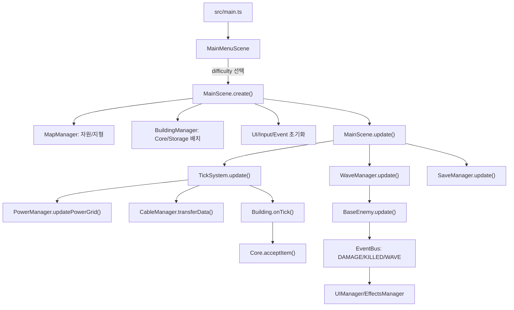

# 아키텍처

## 전체 구조 개요

Neural Factory는 Phaser Scene이 캔버스 런타임을 담당하고, DOM 기반 HUD/모달이 그 위에 겹쳐지는 구조입니다. `MainScene`이 매니저들을 직접 생성해 소유하며, 하위 시스템은 `EventBus`와 Scene 참조를 통해 느슨하게 연결됩니다.

핵심 데이터는 `CONFIG`와 런타임 매니저 상태로 나뉩니다.

- 정적 설정: `src/config.ts`
- 타입 계약: `src/types.ts`
- 런타임 조립: `src/scenes/MainScene.ts`
- 게임 객체: `src/buildings/*`, `src/enemies/BaseEnemy.ts`
- 순수 계산: `src/utils/*`
- DOM UI: `src/managers/UIManager.ts`와 하위 UI 매니저, `index.html`, `src/styles/main.css`

## 화면/UI 흐름

1. `MainMenuScene`이 타이틀, 난이도 버튼, 시작 버튼을 Phaser 텍스트로 렌더링합니다.
2. 시작 시 `MainScene`으로 전환하면서 `#game-hud-shell` 안의 `#top-hud`, `#info-layer`, `#bottom-ui-container` DOM 영역을 표시합니다.
3. `UIManager`가 상단 상태바, 우측 목표/위협/시스템 레일, 하단 빌드 콘솔, 선택 도구 요약, 툴팁, 로그, 게임오버를 제어합니다.
4. 설정/연구/훈련 연구소 UI는 각각 `SettingsUI`, `ResearchUI`, `TrainingLabUI`에 위임됩니다.
5. 모바일은 `MainScene.updateMobileLayoutState()`가 body class를 토글하고, `MobileUIManager`가 액션바/케이블 메뉴/빌드 요약을 갱신합니다. 모바일에서는 HUD 표면이 터치 배치를 가로막지 않도록 pointer-events가 제한됩니다.

주의: Playwright 테스트가 DOM id와 일부 텍스트를 직접 확인합니다. `index.html`, `UIManager`, `main.css` 변경 시 `tests/e2e/app-smoke.spec.ts`를 같이 확인하세요.

## 주요 런타임 흐름

## 게임 루프

`MainScene.update(time, delta)`는 프레임마다 다음을 실행합니다.

- 커서 위치와 그리드 갱신
- `TickSystem.update(time)`로 고정 틱 처리
- `WaveManager.update(delta * gameSpeed)`로 웨이브/적 처리
- `SaveManager.update(delta)`로 자동 저장
- `UIManager.update()`로 HUD/패널 갱신
- `CameraController.update()`로 카메라 이동
- `CableManager.drawCables()`와 이펙트 갱신
- dirty flag가 켜진 전력/방어 오버레이 재그리기

`TickSystem` 내부에서는 매 틱마다 케이블 전송을 처리하고, 짝수 tick마다 전력망 갱신, AP 연결 갱신, 건물 `onTick()` 생산/가공을 수행합니다.

## 상태 관리 구조

상태 저장 위치는 다음처럼 분산되어 있습니다.

| 상태 | 위치 |
|---|---|
| 건물 목록 | `BuildingManager.buildings: Map<string, BaseBuilding>` |
| 아이템 목록 | `ItemManager.items` |
| 케이블/큐 | `CableManager.cables`, `CableManager.apConnections` |
| 전력망 | `PowerManager.networks`, `buildingNetworkMap`, 각 건물 `hasPower` |
| 웨이브/적 | `WaveManager.currentWave`, `enemies`, timer/counter |
| Core 점수/HP | `Core.totalDataReceived`, `confidenceScore`, `hp` |
| 연구 | `ResearchManager.unlockedResearch` |
| 방어 모델 | `MainScene.defenseModelStates` |
| UI 선택/모달 | `UIManager`와 하위 UI 매니저 |
| 저장 데이터 | `localStorage.neural_factory_save` |

전역 상태 저장소는 없고, `MainScene`이 매니저들을 직접 들고 있습니다. 순수 로직은 `utils`로 분리되어 테스트됩니다.

## 데이터/config 로딩 흐름

- `CONFIG.BUILDINGS`는 건물 크기, 비용, 전력, HP, 생산률, 방어 수치, 해금 조건을 정의합니다.
- `CONFIG.RECIPES`는 `AbstractProcessor` 계열이 사용하는 입력/출력/시간입니다.
- `CONFIG.ENEMIES`, `CONFIG.DIFFICULTY`는 `WaveManager`와 `waveSimulation`이 사용합니다.
- `CONFIG.RESEARCH`는 연구 비용, 선행 조건, 해금, 효과를 정의하고 `ResearchManager.getEffectValue()`가 누적합니다.
- `CONFIG.CABLES`와 `CONFIG.ACCESS_POINT`는 `CableManager`, `AccessPoint`, UI 입력 로직이 공유합니다.

새 config 키를 추가하면 타입, 팩토리, i18n, UI, 테스트까지 연결되는지 확인해야 합니다.

## 저장/불러오기 흐름

`SaveManager.saveGame()`은 다음을 `SaveData` 형태로 모아 localStorage에 저장합니다.

- wave 상태와 적 목록
- Core HP/점수
- 건물 위치/회전/버퍼/HP/customState
- 방어 모델 공유 상태
- 필드 아이템
- 케이블과 큐
- 설정: 속도, 오버레이, 난이도, 언어, 사운드, 튜토리얼
- 자원/지형 맵
- 연구 해금 목록

`SaveManager.loadGame()`은 `migrateSaveData()`로 기본값을 보정한 뒤 기존 Phaser 객체를 정리하고, Core/연구/방어모델/건물/아이템/케이블/웨이브/설정을 재생성합니다.

저장 포맷 변경 시 해야 할 일:

1. `src/types.ts`의 `SaveData` 계열 갱신
2. `src/managers/SaveManager.ts` 저장/로드 반영
3. `src/utils/saveMigration.ts` 기본값/버전 처리
4. `src/utils/saveMigration.test.ts` 추가

## 주요 모듈 관계

- `MainScene` -> 모든 manager 생성과 Scene lifecycle 관리
- `BuildingManager` -> `BuildingFactory` -> `buildings/*`
- `TickSystem` -> `PowerManager`, `CableManager`, `BaseBuilding.onTick()`
- `WaveManager` -> `waveSimulation`, `BaseEnemy`
- `BaseEnemy` -> `enemyBuildingInteraction`, `BuildingManager`, `MapManager`
- `CableManager` -> `apRelay`, `AccessPoint`, 건물 버퍼
- `UIManager` -> `progressionGates`, `waveSimulation`, `runResultSummary`, 하위 UI managers
- `ResearchManager` -> `CONFIG.RESEARCH`, Core confidence
- `SaveManager` -> 거의 모든 manager + `saveMigration`

## 신규 기능 추가 위치와 일반 절차

### 새 건물

1. `src/config.ts`에 `CONFIG.BUILDINGS` 항목 추가
2. `src/types.ts`의 `BuildingType` 갱신
3. `src/buildings/`에 클래스 추가 또는 기존 기반 클래스 확장
4. `src/buildings/BuildingFactory.ts` registry에 등록
5. `src/i18n.ts`에 건물명/설명 키 추가
6. 필요하면 `public/assets/buildings/`에 텍스처 추가
7. UI 카테고리/해금/비용이 맞는지 `UIManager`와 `progressionGates` 확인
8. `src/config.test.ts`와 관련 유닛/E2E 추가

### 새 자원/아이템/레시피

1. `CONFIG.ITEMS`와 `CONFIG.RECIPES` 갱신
2. 생산/소비 건물의 `canAcceptItem`, `onTick`, `getOutputSource` 확인
3. 케이블 데이터 아이템이면 `CableManager.DATA_ITEMS`, AP 정책, DataCache 허용 목록 확인
4. Core 점수 반영이 필요하면 `Core.acceptItem()` 갱신
5. 순수 시뮬레이션 테스트 추가

### 새 적/웨이브 규칙

1. `CONFIG.ENEMIES` 수치 추가
2. `WaveManager.spawnEnemy()`와 `BaseEnemy` 특수 효과/시각 갱신
3. `utils/waveSimulation.ts`에 수량/브리핑/추정 HP 반영
4. `waveSimulation.test.ts`, 필요하면 E2E threat panel 갱신

### 새 저장 상태

1. 타입 -> 저장 -> 로드 -> 마이그레이션 -> 테스트 순서로 추가
2. Phaser 객체 cleanup이 필요한 상태라면 `loadGame()`의 기존 상태 정리 구간도 확인

### 새 UI/조작

1. DOM id/class는 `index.html`과 `main.css`에서 먼저 안정적으로 설계
2. `UIManager` 또는 하위 UI manager에 기능 배치
3. 캔버스 포인터와 충돌하면 `InputController.isPointerOverDomUI()` guard 추가
4. 데스크톱/모바일 Playwright smoke 추가
