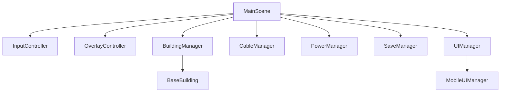

# 🧠 The Neural Factory 종합 진단 및 출시 고도화 보고서
*(Neural Factory Comprehensive Diagnostic & Production Hardening Report)*

본 보고서는 **The Neural Factory** 프로젝트의 코드베이스, 게임 기획 메커니즘, 밸런스, UI/UX 및 기술적 안정성을 전방위로 분석하여, 단순한 기능 작동 수준을 넘어 **실제 상용 출시 가능한 웰메이드 프리미엄 게임**으로 도약하기 위한 핵심 진단과 구체적인 액션 아이템을 제시합니다.

---

## 1. 프로젝트 개요 (Overview)

### 1.1 게임의 정체성 및 핵심 콘셉트
*   **장르 융합**: 공장 자동화(Factorio-like) + 타워 디펜스(Tower Defense) + 방치형/인크리멘탈(Incremental).
*   **독창적 테마**: 물리적인 광석이나 골드를 채굴하는 일반적인 공장 장르의 식상함을 극복하고, **'머신러닝 데이터 파이프라인 구축 및 인공지능 추론'**이라는 지적이고 현대적인 테마를 완벽히 녹여냈습니다.
*   **핵심 플레이 루프**:
    1.  **데이터 수집**: 맵 전역에 흩어진 신호 패치로부터 원시 데이터(`RAW_DATA`, Signal Packet)를 수집.
    2.  **데이터 전처리**: 데이터 가공소(`PROCESSOR`)에서 정규화 및 라벨링을 거쳐 `LABELED_DATA` 생산.
    3.  **학습 및 모델화**: 가중치 학습기(`WEIGHT_TRAINER`) 및 신경망 학습기(`NEURAL_TRAINER`)를 통해 `WEIGHT_UPDATE`와 `TRAINED_MODEL` 생산.
    4.  **추론 및 방어**: 가공된 가중치와 모델 데이터를 디펜스 코어 및 모델 연구소(`MODEL_TRAINING_LAB`)로 전송하여 방어 타워의 **'신뢰도(Confidence Score)'**와 **'모델 버전(Model Version)'**을 갱신.
    5.  **방어전**: 실시간으로 유입되는 DDoS 및 악성 노이즈 트래픽(`ADVERSARIAL_DATA`)을 요격하여 메인 서버(`CORE`)를 수호.

### 1.2 현재 구현 스펙 요약
현재 프로젝트는 코어가 완성된 **플레이어블 알파 빌드** 상태입니다.
*   **물류 시스템**: Silicon 물리 자원을 운송하는 컨베이어 벨트(`CONVEYOR`, `FAST_LINK`)와 데이터 패킷을 양방향 통신하는 이더넷/광섬유 케이블(`CABLES`)이 구현되었으며, 무선 전송을 수행하는 AP 중계기(`ACCESS_POINT`) 세션 릴레이 구조가 탑재되어 있습니다.
*   **방어/적 시스템**: Classifier, Filter, Firewall 3종 타워 및 난이도별 웨이브 시스템(DDoS Bot 스웜, Overfitted Model 보스 포함)이 연동되어 있습니다.
*   **주변 시스템**: 14개 노드의 연구 트리(Confidence Score 차감식 해금), `localStorage` 기반 자동/수동 세이브 및 버전 마이그레이션 모듈, 영/한 다국어 번역 시스템 및 모바일 미디어 쿼리 기반 반응형 터치 HUD가 완성되어 있습니다.

---

## 2. 코드 구조 분석 (Codebase Architecture Critique)

최근 진행된 대대적인 리팩토링 작업을 통해 프로젝트의 유지보수성은 비약적으로 상승했습니다. 특히 거대했던 메인 씬과 UI 책임이 다수의 서브 매니저 및 전용 컨트롤러로 이관된 점이 긍정적입니다.

### 2.1 폴더 및 모듈화 수준
*   `src/buildings/`: 모든 건물 유형이 `BaseBuilding`을 상속하는 객체지향 구조로 깔끔히 파편화되어 OCP(개방-폐쇄 원칙)를 따르려 노력하고 있습니다.
*   `src/controllers/`: 마우스/터치 입력을 통제하는 `InputController`와 디버그용 그리드/시각화 범위를 처리하는 `OverlayController`가 메인 씬으로부터 성공적으로 격리되었습니다.
*   `src/managers/`: 전력망 분리 및 머징을 다루는 `PowerManager`, 케이블 큐 연산 및 병목 전송을 다루는 `CableManager` 등으로 세밀하게 분리되어 책임이 격리되어 있습니다.



### 2.2 코드 복잡도 및 아키텍처적 부채 (Technical Debt)

#### ① UIManager.ts의 비대화와 렌더링 무거움
*   **상황**: `SettingsUI.ts`, `ResearchUI.ts`, `TrainingLabUI.ts`가 성공적으로 추출되었으나, 메인 `UIManager.ts`(~22KB)는 여전히 전반적인 HUD 그리기, 대형 정보 툴팁 생성, 자원 실시간 모니터링 로그, 그리고 모바일 전용 UI 갱신 상태까지 홀로 제어하고 있습니다.
*   **문제점**: UI의 세부 구조 변경이 일어날 때마다 `UIManager`를 수정해야 하므로 단일 책임 원칙(SRP)에 위배되며, 컴포넌트 간 강결합으로 인해 UI 디버깅이 까다롭습니다.

#### ② EventBus.off() 메소드의 사이드 이펙트 유발 구조
*   **상황 (`src/managers/EventBus.ts` L38-51)**:
    ```typescript
    off<K extends keyof EventMap>(event: K, callbackOrOwner?: EventCallback<EventMap[K]> | string): void {
        if (!callbackOrOwner) {
            delete this.events[event];
            return;
        }
        // ... 생략
    }
    ```
*   **문제점**: 매개변수로 오너(Owner)나 특정 콜백 없이 `off('WAVE_STARTED')` 처럼 단순 이벤트를 호출하면 해당 이벤트를 구독하고 있던 **시스템 전역의 모든 리스너가 예외 없이 강제 파괴**되는 구조입니다. 가독성이 낮고 의도치 않은 버그(예: 오버레이 갱신 리스너가 지워져서 화면 깜빡임 먹통)를 일으키는 원흉입니다.

#### ③ 객체 생성/복원에 대한 하드코딩 식별자 (타입 캐스팅 의존)
*   **상황 (`SaveManager.ts` L43, L216)**:
    세이브 데이터를 추출하거나 씬에 로딩할 때, `if (b.type === 'NEURAL_TRAINER')` 또는 `if (existingBuilding instanceof NeuralTrainer)`와 같이 특정 클래스 형태에 대한 고유 분기 처리가 직렬화/역직렬화 곳곳에 분산되어 있습니다.
*   **문제점**: 새로운 고급 가공 건물이나 기믹성 타워를 개발할 때마다 `SaveManager`와 `MainScene` 등 3~4개 이상의 다른 소스 코드를 헤집으며 예외형 분기를 손수 기재해야 합니다. 이는 확장성 관점에서 치명적인 한계입니다.

---

## 3. 게임성 분석 (Gameplay Experience Critique)

### 3.1 핵심 재미 요소의 작동 여부
*   **독보적인 테마 일치성**: 데이터를 전처리하고, 이를 활용해 타워 성능을 갱신하는 매커니즘은 매우 훌륭합니다. 단순 자원 보급을 넘어, "학습을 중단하면 타워 신뢰도(Confidence)가 떨어져 방어벽이 뚫린다"는 **'학습 및 유지 비용'**의 장치가 디펜스 장르 특유의 긴장감을 증폭시킵니다.

### 3.2 흐름 및 진행감(Progression Curve)의 한계

#### ① 초반 밸런스 정체와 조작 부재 (Early-Game Slump)
*   **현상**: 게임 초기 단계에서 플레이어는 자원 추출기(`MINER`)와 저장 창고를 짓고 난 직후, 다음 건물을 짓기 위한 Silicon 자원이 모일 때까지 마우스를 놓고 화면을 하염없이 바라보는 **대기 병목 시간(약 1~2분)**이 발생합니다.
*   **원인**: 자원 채굴 속도와 자원의 제공 버퍼가 극단적으로 타이트하여 초반 자동화 공장 특유의 '신속한 확장 및 최적화' 쾌감이 지연됩니다.

#### ② 적 스폰 벡터 정보 부족으로 인한 전술성 저하
*   **현상**: 디펜스 게임의 핵심은 **"어느 경로로 적이 밀려오는가?"**를 예측하고 이에 최적화된 바리케이드와 방화벽 및 요격 라인을 구성하는 데 있습니다. 그러나 본 게임은 맵의 외곽 경계 도처에서 적들이 불쑥 기습 생성됩니다.
*   **문제점**: 플레이어는 미리 예측하여 방어 시설을 짓지 못하고, 적이 뚫고 들어오는 것을 사후적으로 목격한 후에야 임기응변식으로 방화벽을 깔게 되므로, **'파이프라인 레이아웃을 정교하게 다듬는 장기적 전략성'**의 매력이 대폭 희석됩니다.

#### ③ 후반부 성장의 천장과 동기 부여 결여 (Late-Game Ceiling)
*   **현상**: 연구 트리를 전부 해금하고 모델 정확도를 100% 근처로 마스터하고 나면, 더 이상 공장을 확장하거나 스케일을 키워야 할 유인이 급감합니다.
*   **문제점**: 인크리멘탈 장르의 문법인 '기하급수적 수치 상승'과 '프레스티지/계승(Rebirth)'을 통한 글로벌 효율 업그레이드 장치가 부재하여, 중후반 20웨이브 이후 급격히 플레이의 목적성을 상실하게 됩니다.

---

## 4. 밸런스 분석 (System Balancing Critique)

### 4.1 생산 및 소모 파이프라인의 조율

```
[물리 벨트 파이프라인] 
  Miner (Silicon Patch) --(Silicon)--> Conveyor Belt ----> Storage / Advanced Crafters

[데이터 전송 파이프라인]
  Downloader --(Raw Data)--> Ethernet Cable --(Labeled)--> Weight Trainer --(Weight Update)--> Core
```

*   자원 이원화는 테마적으로 매우 완성도 높습니다. Silicon은 **컨베이어 벨트**로 실물 운송하고, 데이터는 **케이블/무선**으로 고속 전송하는 차별화가 돋보입니다.
*   그러나 **물류 벨트 사용의 극단적 축소**가 발생합니다. 공장의 절대다수를 차지하는 데이터 라인이 전부 무형의 통신선(케이블 가이드 라인)으로 단순 대체되다 보니, 팩토리오 장르의 원초적 재미인 **'수많은 벨트가 꼬이며 발생하는 병목을 해결하는 공간적 퍼즐'**의 재미가 현저히 감소합니다.

### 4.2 건물 효율성 및 밸런스 단절점
*   **Solar Panel의 설명 불투명성**:
    *   `SOLAR_PANEL`은 독립형 전력 전용(`RANGE: 0`)으로 설계되어 전력망 병합에 관여하지 않고 오직 배치된 자기 타일의 1x1 건물만 전력을 독점 커버합니다.
    *   하지만 초보 플레이어는 이를 설명만 보고 알 수 없기에, 발전소처럼 전송선 인근에 다량 구축한 뒤 "왜 전력이 공유되지 않지?"라며 오인할 여지가 매우 큽니다.
*   **난이도 배율의 급격한 격차**:
    *   Normal 난이도 대비 Hard 난이도의 적 HP가 **50%(`1.5배`)** 급상승합니다.
    *   Hard 이상으로 갈 경우, 초반 자원 수급의 병목 상태를 해소하기도 전에 밀려오는 적의 HP 누적치를 타워의 초기 낮은 Confidence Score(초기 35%)의 화력으로 감당하기 힘들어 초반 패배율이 과도하게 높게 나타납니다.

---

## 5. UI/UX 분석 (UI/UX Friction Points)

유려한 돔 레이아웃과 달리, 세부 조작 단계에서 플레이어에게 불쾌감을 안겨주는 3대 마찰점(Friction Points)이 직접 플레이 시 도드라집니다.

### 5.1 3대 핵심 UX 치명 결함

#### ① UI 모달 닫기 후 키보드 포커스 상실 (Focus Lockout)
*   **현상**: 연구 트리를 둘러보고 창을 닫거나, 설정 창을 터치하여 설정을 수정한 뒤, 필드로 돌아와 `W A S D` 카메라 이동 키를 누르면 **화면이 꿈쩍도 하지 않습니다.**
*   **원인**: DOM UI 모달과 상호작용하는 와중에 웹 브라우저의 포커스가 Phaser Canvas 영역을 이탈하여 DOM 노드로 귀속되었기 때문입니다.
*   **영향**: 플레이어는 카메라를 움직이려면 게임 월드 한가운데를 강제로 마우스 클릭하여 포커스를 직접 복구해야만 합니다. 전투가 일어나는 긴박한 멀티태스킹 상황에서 매우 빈번한 조작 방해 요소입니다.

#### ② 하단 타일을 가로막는 초대형 고정 툴팁 (Screen Clogging)
*   **현상**: 건물의 상태나 노이즈 패치 정보를 알려주는 UI 툴팁 패널이 하단 빌드바 바로 위에 지나치게 큰 고정 영역으로 팝업됩니다.
*   **영향**: 플레이어가 화면 하단부 근처 그리드에 컨베이어나 케이블을 조밀하게 배치하려 할 때, 마우스 오버로 발동된 대형 툴팁이 정작 **내가 마우스를 올려 짓고자 하는 대상 타일과 주변 영역을 완전히 가려버려** 배치를 근원적으로 불가능하게 만듭니다.

#### ③ Ghost 상태에서의 유효 범위 가이드라인 부재 (Placement Blindness)
*   **현상**: 전력 송신탑(`POWER_NODE`)이나 방어 타워(`CLASSIFIER`, `FILTER`)를 배치하기 위해 건설 청사진(Ghost)을 그리드 위에서 움직일 때, 이 건물들이 완공되었을 때 도달할 **유효 전력 범위(Range 5)나 사격 사거리 범위**가 사전에 링(Ring)이나 에어리어 형태로 노출되지 않습니다.
*   **영향**: 플레이어는 자원을 아끼기 위해 정밀하게 노드를 배치해야 함에도 불구하고, "일단 설치해보고 전선이 연결되는지 안 되는지 확인"해야 하는 **불합리한 Trial and Error**를 경험하게 됩니다.

---

## 6. 비주얼 및 연출 분석 (Visuals & Game Aesthetics)

### 6.1 비주얼적 부조화 (Aesthetic Mismatch)
*   **HUD**: 현대적이고 유려한 반투명 글래스모피즘(backdrop blur)과 글로우 효과가 적용되어 프리미엄한 인상을 줍니다.
*   **Phaser 인게임 화면**: 실리콘 패치, 전력망 라우터, 타워 스프라이트가 기본 단순 원색 단색 사각형과 지극히 투박한 선들로만 드로잉되어 있습니다. UI의 훌륭한 디자인 퀄리티와 인게임의 거친 그래픽이 불협화음을 이루며 몰입을 방해합니다.

### 6.2 마비된 공장의 시각 피드백 결여 (Outage Blindness)
*   **현상**: 전력망이 블랙아웃되거나 발전용 Silicon 공급이 막혀 공장 내부의 모든 데이터 생산 라인이 통째로 올스톱되더라도, 인게임 타일 상의 건물들은 아무런 비주얼 피드백을 주지 않습니다.
*   **문제점**: 플레이어는 어디서 병목이 발생해 가중치 갱신이 중단되었는지를 즉각 진단할 수 없습니다. 일일이 모든 건물을 하나하나 마우스 오버해 보며 버퍼의 상태와 전력 여부를 수동 감시해야 하므로 심각한 조작 피로를 낳습니다.

---

## 7. 기술적 안정성 분석 (Technical Stability & Performance)

### 7.1 데이터 로딩 시의 구조적 불안정성
*   `SaveManager.ts` 내부의 복원 모듈은 저장된 데이터의 포맷에 대한 방어적 널(Null) 체크 및 예외 기본값 적용이 느슨합니다. 
*   새로운 연구 노드나 신규 건물 스펙이 `config.ts`에 지속적으로 편입될 때, 예전 알파 세이브 파일을 읽는 즉시 초기화되지 않은 `customState` 파싱 단계나 `normalizeQueuedPacket`에서 런타임 크래시가 유발될 환경적 위험이 농후합니다.

### 7.2 AP 무선 전송 모듈의 대규모 O(n) 루프 성능 저하 가능성
*   **현상**: `transferWirelessData` 연산 시, 매 틱마다 맵에 구축된 모든 건물의 키 값을 검사하여 근방의 수신자와 송신자의 거리를 단순 유클리드 좌표 평면 연산으로 계산해 세션을 할당합니다.
*   **문제점**: 플레이어가 기지를 기하급수적으로 대규모로 확장해 건물의 개수가 수백 개에 도달할 경우, O(n) 거리 계산 연산 비용이 브라우저 메인 스레드에 누적되어 주기적인 화면 틱 렉(Tick-rate lag)을 발생시키는 핵심 병목 요소로 작용하게 됩니다.

---

## 8. 출시 가능성 분석 (Production Readiness Assessment)

### 8.1 현재 상태 평가
*   **출시 준비도**: `65%`
*   **평가**: 핵심 엔진 루프와 데이터 체인 가공, 웹 터치 UI 대응, 로컬 세이브까지의 코어 로직은 버그 없이 대단히 매끄럽게 돌아갑니다. **무료 인디 게임 플랫폼(itch.io)이나 포트폴리오 사이트에 데모 버전으로 당장 등재해도 될 수준의 완성도**를 자랑합니다.

### 8.2 상용 유료 출시(Steam 등)를 위한 3대 불가결 요건
1.  **조작감 및 UX 마찰 제로화**: WASD 포커싱 먹통 해결, 툴팁 사각지대 개편, 범위 미리보기 장치 도입.
2.  **그래픽 완성도의 조화**: Phaser 내부 그래픽 요소의 텍스처링 품질 상향, 파티클 이펙트, 전력 차단/버퍼 막힘 발생 시 건물 상단 경고 점멸 네온 플래그 시스템 구축.
3.  **다국어(영/한) 번역 톤앤매너 완벽 단일화**: 현재 `POWER OUTPUT`과 `전력 출력`, `Recycling Loop`와 `리사이클 루프` 등이 인게임에서 뒤섞여 있습니다. 이 혼용을 완전히 정리하여 옵션 선택에 따라 깔끔하게 로컬라이징되도록 언어 리소스를 전면 정비해야 합니다.

---

## 9. 우선순위별 개선 계획 (Actionable Roadmap)

### 🚨 P0: 즉시 수정해야 하는 치명적 결함

#### ① UI 모달 종료 시 Phaser Canvas 포커스 복구 유실
*   **문제 설명**: 연구 트리, 설정 모달, 학습 랩 창을 닫은 뒤 WASD 입력이 즉각 작동하지 않음.
*   **영향 및 중요성**: 치명적인 조작감 불쾌감 유발. 유저가 화면을 마우스로 다시 찍어야 조작이 가능해져 디펜스 게임의 급박한 대처를 방해함.
*   **수정 방향**: `UIManager.ts` 내 모달을 닫는 공통 메소드(`closeModal`) 실행 직후, Phaser Canvas에 강제로 `.focus()`를 호출해 포커스를 즉각 환원시킴.
*   **예상 난이도**: 매우 낮음 (1~2줄의 코드 수정).
*   **기대 효과**: 모달을 닫고 마우스 조작 없이도 즉각 키보드로 스무스한 화면 카메라 스크롤 가능.

#### ② EventBus.off()의 무조건적 전역 리스너 몰살 설계 결함
*   **문제 설명**: `EventBus.off(event)` 실행 시 소유자 필터 없이 이벤트 내 모든 등록 리스너를 한꺼번에 delete함.
*   **영향 및 중요성**: 컴포넌트가 생명주기에 의해 소멸하면서 자기 리스너만 떼려다가 전역 시스템 리스너까지 같이 파괴하여 런타임 오동작을 유발함.
*   **수정 방향**: `off` 메소드의 두 번째 인자가 없을 때 전역 삭제를 원천 차단하고 경고를 띄우거나, 등록 당시의 `owner` 필터를 의무화하는 방어 코드로 보강.
*   **예상 난이도**: 낮음.
*   **기대 효과**: 생명주기 제어 시 등록/해제 부작용에 의한 예측 불가능한 스크립트 먹통 현상 완전 해소.

#### ③ 태양광 패널 (Solar Panel) 전력 속성 오인 방지 명시
*   **문제 설명**: 독립 전력 전용으로 전력망에 닿지 않는 `SOLAR_PANEL`이 HUD 설치 바에 "태양광 발전"이라는 명칭으로만 단순 등재되어 있어 유저 오해 유발.
*   **영향 및 중요성**: 플레이어가 쓸모없는 그리드를 건설하며 자원을 낭비하고 시스템 규칙을 불신하게 됨.
*   **수정 방향**: 빌드 바 툴팁과 설명 라벨에 `[독립형 전용 - 전력망 연결 불가]` 문구를 네온 옐로우 경고 색상으로 극명히 노출.
*   **예상 난이도**: 매우 낮음 (텍스트 번역 데이터 보강).
*   **기대 효과**: 전력 공급 레이아웃 설계 시 불필요한 시행착오 전면 소멸.

---

### 🛠️ P1: 출시 전 반드시 개선해야 하는 요건

#### ① 영한 다국어 텍스트 혼용 전면 정리
*   **문제 설명**: HUD 헤더, 탭 타이틀, 연구 노드 설명 등에서 한국어와 영어 텍스트가 마구 혼재되어 출시 수준의 품격을 떨어트림.
*   **영향 및 중요성**: 완성되지 않은 미완성 빌드의 인상을 강하게 남겨 스팀 상용 판매 시 마이너스 평가 요인으로 작용함.
*   **수정 방향**: `i18n.ts` 내의 모든 영어 키들을 완전히 언어 설정 변수에 귀속시켜 `t('power.output')` 처럼 한 방향으로 포맷팅.
*   **예상 난이도**: 보통.
*   **기대 효과**: 게임의 전반적인 완성도와 신뢰감이 극적으로 상승하고 프리미엄한 상용 게임의 품질 보증.

#### ② 화면 하단 정보 툴팁 사각지대 및 크기 개선
*   **문제 설명**: 마우스 오버 시 뜨는 정보 툴팁이 하단 빌드바 상단에 거대하게 고정되어 그리드 하단을 가림.
*   **영향 및 중요성**: 하단 그리드 근처에 건물을 조밀하게 배치하는 조작이 툴팁에 가로막혀 마우스 조작을 가로막음.
*   **수정 방향**: 정보 툴팁을 마우스 포인터 근처에 따라다니는 '플로팅 툴팁'으로 전향하거나, 화면 좌하단/우하단의 고정 사이드 공간으로 앵커를 변경.
*   **예상 난이도**: 보통 (CSS 및 DOM 구조 변경 필요).
*   **기대 효과**: 건설 방해 요소가 사라져 맵 전역을 100% 쾌적하게 활용 가능.

#### ③ 건물 마비 상태(블랙아웃/버퍼 가득참)의 인게임 시각 경고 연출
*   **문제 설명**: 전력 부족이나 유송로 병목이 터져도 인게임 스프라이트 상으로는 아무 변화가 없어 마비 진단이 늦어짐.
*   **영향 및 중요성**: 플레이어는 공장이 멈춘 원인을 찾는 데 과도한 피로감을 느낌.
*   **수정 방향**: 전력 부족 상태의 건물 위에 붉은색 번개 아이콘 플래시, 버퍼 풀 상태의 가공소에 노란색 꽉참 경고 마커 오버레이 렌더링.
*   **예상 난이도**: 보통.
*   **기대 효과**: 기지 마비 요인을 단 0.1초 만에 눈으로 직관적 판별하여 공장 정상화 속도 극대화.

---

### ✨ P2: 완성도를 높이기 위한 디테일 폴리싱

#### ① 적 스폰 벡터 방향 경보 지시기 추가
*   **문제 설명**: 사전에 적이 어느 지점들로 들이닥치는지 사전 정보를 알 수 없음.
*   **영향 및 중요성**: 디펜스 게임 고유의 '사전 병력 요격선 구축' 전략이 무력화되고 맹목적인 사후 복구식 조작을 강요함.
*   **수정 방향**: 웨이브 타이머 종료 3초 전부터 화면 외곽 테두리에 붉은색 네온 레이저 흐름 벡터 화살표나 침투 예고 마커를 점멸시킴.
*   **예상 난이도**: 보통 (Phaser 오버레이 연산).
*   **기대 효과**: 플레이어가 다가올 경로에 맞게 선제적으로 화력망과 방화벽을 구상하여 전략 게임 본연의 재미 강화.

#### ② Ghost 상태에서의 노드/타워 범위 미리보기
*   **문제 설명**: 송신탑이나 타워 배치 시 유효 사거리/커버리지가 건설 완료 전에 시각화되지 않음.
*   **영향 및 중요성**: 자원의 오버랩 낭비를 막기 위한 노드 간 조밀 배치 퍼즐이 불가능해짐.
*   **수정 방향**: 마우스에 붙어 다니는 건설 Ghost 청사진 테두리에 얇은 점선 네온 원을 그려 전선 및 사거리를 직관적으로 투사함.
*   **예상 난이도**: 보통.
*   **기대 효과**: 정교하고 아름다운 완벽한 도심식 전력/방어 기지 파이프라인 디자인 가능.

#### ③ 초반 진행 템포 단축 및 Silicon 초기 수급량 미세 상향
*   **문제 설명**: 게임 초기 Silicon을 모아 다음 프로세서를 짓는 동안 극심한 대기 정체 타임이 발생.
*   **영향 및 중요성**: 초기 진입 유저가 지루함을 느끼고 극초반 튜토리얼 단계에서 이탈할 확률을 키움.
*   **수정 방향**: 초기 제공 창고의 Silicon 버퍼를 30 -> 45로 상향 조정하고, Miner의 극초반 기본 생산 딜레이를 10% 단축 보조.
*   **예상 난이도**: 매우 낮음.
*   **기대 효과**: 시작 즉시 막힘없이 기본 파이프라인을 구축해 자동화의 쾌감에 스무스하게 유저를 락인(Lock-in).

---

### 🚀 P3: 장기적인 전략적 콘텐츠 확장 계획

#### ① 기하급수 성장 스케일을 반영한 프레스티지(Epoch Rebirth) 연동
*   **문제 설명**: 후반 연구를 다 깨고 난 뒤 목표 의식이 사라져 플레이 장기 유지가 안 됨.
*   **수정 방향**: 에포크 점수가 최고치에 달했을 때 기지를 초기화하고 전역 학습 효율, 전력 대역폭을 영구 부스팅하는 프레스티지 시스템 연동.
*   **예상 난이도**: 높음.
*   **기대 효과**: 다회차 반복 플레이의 절대적 명분을 쥐여주어 장기적인 중독성 플레이 타임 극대화.

#### ② AP 무선 중계 탐색 공간 인덱싱 최적화 (Spatial Hash Grid)
*   **문제 설명**: 맵의 타일이 늘어날수록 O(n) 유클리디안 탐색이 성능 프레임 드랍을 야기함.
*   **수정 방향**: 건물을 탐색할 때 Spatial Hash Grid 기법을 써서 타겟 건물의 주변 25개 버킷 영역만 스캔하도록 쿼리 구조 변경.
*   **예상 난이도**: 보통 ~ 높음.
*   **기대 효과**: 맵이 200x200 타일 이상으로 기하급수적 확대되어도 프레임 드랍 없는 모바일 및 저사양 브라우저 호환 보장.

#### ③ 네온 쉐이더 및 글로우 스프라이트 가미
*   **문제 설명**: 심심한 인게임 2D 도형 스프라이트와 매우 세련된 DOM HUD 간의 그래픽적 퀄리티 간극.
*   **수정 방향**: Phaser 내부의 투사체, 타워, 케이블에 WebGL 기반 Neon Glow 쉐이더를 얹어 사이버펑크 톤앤매너 비주얼을 월드로 전이시킴.
*   **예상 난이도**: 높음 (WebGL 및 커스텀 쉐이더 작성).
*   **기대 효과**: 스크린샷과 트레일러만으로도 플레이어의 수집/소장 욕구를 강하게 WOW시킬 수 있는 시각 완성도 확립.

---

## 10. 최종 평가 (Executive Verdict)

### 🌟 독보적인 강점
본 프로젝트의 최대 자산은 **'테마와 시스템의 영리하고 지적인 융합'**에 있습니다. 인공지능 시대를 직관적으로 비튼 신선하고 현대적인 하이테크 네러티브, 그리고 글래스모피즘 HUD가 선사하는 고급스러운 첫인상은 시장에서 충분한 시선을 끌 경쟁력을 갖추고 있습니다.

### ⚠️ 넘어야 할 가장 큰 벽
가장 아쉬운 약점은 **'인게임 월드 그래픽의 거친 완성도'**와 **'미세 조작(WASD 포커스, 툴팁 가림)의 사소하지만 거슬리는 마찰점들'**입니다. 고급 리무진을 타고 있는데 시트의 마감이 덜 다듬어져 불편함을 느끼는 형태에 비유할 수 있습니다. 

### 🏁 최종 출시 전망 및 제안
1.  **플랫폼 전략**: Capacitor 패키징을 통한 모바일 태블릿 스토어 출시 및 itch.io 웹 배포가 가장 적합합니다.
2.  **재미 극대화를 위한 한 줄 제안**:
    > *"가중치를 과도하게 공급하여 한쪽 모델이 편향되는 **'오버피팅(Overfitting) 폭주 기믹'**을 전술적 디메리트로 넣고, 이를 해소하기 위해 전처리 정규화 카드를 삽입하는 동적 시스템을 강화한다면, 유저는 단조로운 방치를 넘어 끊임없이 하이퍼파라미터를 튜닝하는 듯한 짜릿하고 독보적인 재미에 깊게 중독될 것입니다."*
