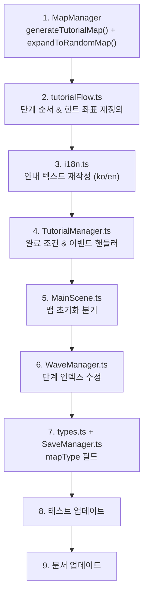

# 튜토리얼 맵 + 튜토리얼 시스템 전면 개선

## 목표

1. **튜토리얼 전용 맵**을 도입하여 학습에 최적화된 고정 배치 제공
2. 튜토리얼 완료 시 **맵을 확장**(기존 건물 유지 + 랜덤 자원/지형 추가)
3. 튜토리얼 단계 순서, 안내 텍스트, 완료 조건을 전면 개선

---

## User Review Required

> [!IMPORTANT]
> **맵 전환 방식**: 튜토리얼 완료 시 씬을 리로드하지 않고, 기존 건물/케이블/아이템을 유지한 채 **맵만 확장**합니다. 플레이어가 쌓아온 공장이 보존되면서 새로운 자원 패치와 지형이 추가되는 방식입니다.

> [!WARNING]
> **기존 세이브 호환성**: `SaveData`에 `mapType` 필드가 추가됩니다. 기존 세이브는 migration에서 `mapType: 'random'`으로 기본 처리되어 호환됩니다.

> [!WARNING]
> **튜토리얼 단계 수 변경 (7→8)**: WaveManager에서 `savedStep` 인덱스로 분기하는 로직이 있어, 인덱스가 모두 재조정됩니다.

---

## Proposed Changes

### 1. 튜토리얼 전용 맵 생성

#### [MODIFY] [MapManager.ts](file:///c:/Users/user/Desktop/projects/factor/src/managers/MapManager.ts)

`generateTutorialMap()` 메서드 추가:

```typescript
generateTutorialMap(): void {
    this.resourceMap.clear();
    this.terrainMap.clear();
    
    // 1) 실리콘 패치: 코어 왼쪽 상단 (-5,-3) 3x3 — 채굴기를 놓기 좋은 위치
    this.addPatch(-5, -3, 3, 'SILICON');
    
    // 2) 에너지 패치: 코어 오른쪽 하단 (2,2) 3x3
    this.addPatch(2, 2, 3, 'ENERGY');
    
    // 3) 추가 실리콘 패치: 코어 오른쪽 (-2,-6) — 확장용
    this.addPatch(-2, -6, 2, 'SILICON');
    
    // 4) 단순화된 lane blocker: 북쪽 침입 경로를 명확하게
    this.addTutorialLaneBlockers();
}
```

튜토리얼 맵 배치 설계:

```
         NORTH (적 침입 방향)
              ↓
    ██ ██       ██ ██      ← Blocker로 좁은 통로 형성
        [통로]
    Si Si                  ← 추가 실리콘 패치
                           
    Si Si Si   ┌──────┐
    Si Si Si   │ CORE │   ← 코어 (4x4)
    Si Si Si   │      │
               └──────┘
                    En En En  ← 에너지 패치
                    En En En
```

**핵심**: 적 침입이 북쪽에서만 오고, 좁은 통로를 통과하도록 blocker를 배치 → 방어 위치가 직관적

`addTutorialLaneBlockers()`:
- 기존 `addEarlyLaneBlockers()`보다 더 명확한 단일 통로 형성
- 북쪽 통로 폭을 3타일로 좁혀서 방어 배치 위치가 자명하게

`expandToRandomMap()` 메서드 추가:
- 튜토리얼 맵의 기존 자원/지형은 유지
- 코어 반경 8타일 밖에 추가 랜덤 자원 패치 생성 (8~12개)
- 기존 `addEarlyLaneBlockers()` 패턴으로 추가 lane blocker 생성
- 동/서/남 방향에도 침입 경로용 지형 추가

---

### 2. 튜토리얼 힌트 좌표를 맵에 맞게 조정

#### [MODIFY] [tutorialFlow.ts](file:///c:/Users/user/Desktop/projects/factor/src/utils/tutorialFlow.ts)

`TUTORIAL_HINT_POSITIONS` 좌표를 튜토리얼 맵에 정확히 일치하도록 재설정:

```typescript
export const TUTORIAL_HINT_POSITIONS = {
    // 실리콘 패치 중심 (Grid좌표 -5,-3 → World좌표)
    siliconResource: tileCenter(-4 * 32, -2 * 32),
    energyResource: tileCenter(3 * 32, 3 * 32),
    
    // Step 2: 수집기를 코어 전력 범위 안, 빈 타일에
    downloader: { x: -5 * 32, y: 0 },
    
    // Step 3: 케이블 연결 흐름
    // (수집기 → 코어 방향)
    
    // Step 4: 전력 노드를 전력 범위 경계에
    powerNode: { x: -5 * 32, y: -3 * 32 },
    
    // Step 5: 프로세서를 수집기 근처에
    processor: { x: -5 * 32, y: -4 * 32 },
    
    // Step 6: 방어 건물을 통로 앞에
    defense: { x: -1 * 32, y: -7 * 32 },
    
    // Step 8: 모델 훈련소
    modelLab: { x: 5 * 32, y: 0 },
    
    // 기존 위치들
    miner: { x: -5 * 32, y: -3 * 32 },
    storage: { x: -2 * 32, y: 0 },
    trainer: { x: -4 * 32, y: -5 * 32 },
} as const;
```

> 실제 구현 시 튜토리얼 맵의 배치와 정확히 일치하도록 좌표를 최종 조정합니다. 핵심은 모든 고스트 힌트가 **실제 건설 가능한 빈 타일 + 전력 범위 안**에 위치하는 것입니다.

**단계 순서 & 정의 변경**:

| # | ID | title (ko) | allowedBuildings | 완료 조건 |
|---|-----|-----------|-----------------|----------|
| 1 | RESOURCE | 자원 확인 | `[]` | 3초 딜레이 후 자동 |
| 2 | EXTRACTION | 첫 건물 배치 | `['DATA_DOWNLOADER', 'MINER']` | MINER 또는 DATA_DOWNLOADER 하나 배치 |
| 3 | CONNECTION | 케이블 연결 | `['BASIC', 'REMOVE']` | CABLE_CONNECTED 이벤트 |
| 4 | POWER | 전력망 확장 | `['POWER_NODE']` | POWER_NODE 배치 |
| 5 | PROCESSING | 데이터 가공 라인 | `['PROCESSOR', 'WEIGHT_TRAINER', 'BASIC', 'REMOVE']` | PROCESSOR 또는 WEIGHT_TRAINER 배치 |
| 6 | DEFENSE | 방어선 배치 | `['CLASSIFIER', 'FIREWALL', 'REMOVE']` | CLASSIFIER 또는 FIREWALL 배치 |
| 7 | FIRST_WAVE | 첫 웨이브 생존 | `null` (전체 해금) | WAVE_ENDED 이벤트 |
| 8 | RESEARCH | 성장 경로 | `null` (전체 해금) | MODEL_TRAINING_TARGET_SET 이벤트 |

`TutorialStepId` 타입에 `'EXTRACTION'` | `'FIRST_WAVE'` 추가, `'DATA_SOURCE'` 제거.

---

### 3. 완료 조건 & 이벤트 핸들러 수정

#### [MODIFY] [TutorialManager.ts](file:///c:/Users/user/Desktop/projects/factor/src/managers/TutorialManager.ts)

**RESOURCE 단계 딜레이**:
```typescript
private checkResourceStep(): void {
    const hasResource = Array.from(this.scene.mapManager.getResourceMap().values())
        .some(type => type === 'SILICON' || type === 'ENERGY');
    if (hasResource) {
        // 3초 후 자동 완료 (플레이어가 맵을 둘러볼 시간)
        this.scene.time.delayedCall(3000, () => {
            this.completeStep('RESOURCE');
        });
    }
}
```

**EXTRACTION 단계** (기존 DATA_SOURCE):
```typescript
// MINER 또는 DATA_DOWNLOADER 하나만 배치하면 완료
if (activeStep.id === 'EXTRACTION' && (type === 'MINER' || type === 'DATA_DOWNLOADER')) {
    this.completeStep('EXTRACTION');
}
```

**CONNECTION 단계**:
```typescript
// 케이블 연결만으로 완료 (CONVEYOR 배치는 트리거하지 않음)
EventBus.on('CABLE_CONNECTED', () => {
    const activeStep = this.steps.find(step => !step.completed);
    if (activeStep?.id === 'CONNECTION') {
        this.completeStep('CONNECTION');
    }
});
```

**DEFENSE 단계**:
```typescript
// 방어 건물 배치로 완료 (기존: WAVE_STARTED)
if (activeStep.id === 'DEFENSE' && (type === 'CLASSIFIER' || type === 'FIREWALL' || type === 'FILTER')) {
    this.completeStep('DEFENSE');
}
```

**FIRST_WAVE 단계**:
```typescript
EventBus.on('WAVE_ENDED', () => {
    const activeStep = this.steps.find(step => !step.completed);
    if (activeStep?.id === 'FIRST_WAVE') {
        this.completeStep('FIRST_WAVE');
    }
});
```

**튜토리얼 완료 시 맵 확장 트리거**:
```typescript
// completeAll() 또는 마지막 단계 완료 시
if (this.steps.every(item => item.completed)) {
    this.completed = true;
    this.persistProgress();
    this.scene.mapManager.expandToRandomMap();
    this.scene.gridRenderer.draw(true);
    // ...
}
```

---

### 4. 안내 텍스트 재작성

#### [MODIFY] [i18n.ts](file:///c:/Users/user/Desktop/projects/factor/src/i18n.ts)

한국어:
```
tutorial.RESOURCE.title    → "자원 확인"
tutorial.RESOURCE.detail   → "맵에 빛나는 타일이 자원입니다. 파랑=실리콘, 노랑=에너지. 잠시 후 자동으로 넘어갑니다."
tutorial.EXTRACTION.title  → "첫 건물 배치"
tutorial.EXTRACTION.detail → "하단 '추출' 탭에서 패킷 수집기를 선택하고, 노란 전력 범위 안의 빈 타일을 클릭해 배치하세요."
tutorial.CONNECTION.title  → "케이블 연결"
tutorial.CONNECTION.detail → "'물류' 탭에서 이더넷 케이블을 선택하세요. 패킷 수집기를 클릭 → 연결할 건물을 클릭하면 데이터가 흐릅니다."
tutorial.POWER.title       → "전력망 확장"
tutorial.POWER.detail      → "전력 범위 밖의 건물은 작동하지 않습니다. '전력' 탭에서 전력 릴레이를 배치해 전력망을 넓히세요."
tutorial.PROCESSING.title  → "데이터 가공"
tutorial.PROCESSING.detail → "'생산' 탭에서 라벨링 파이프라인을 배치하고, 케이블로 수집기와 연결하세요."
tutorial.DEFENSE.title     → "방어선 배치"
tutorial.DEFENSE.detail    → "곧 북쪽에서 적이 옵니다! '방어' 탭에서 분류 모델을 통로 근처에 배치하세요."
tutorial.FIRST_WAVE.title  → "첫 웨이브 생존"
tutorial.FIRST_WAVE.detail → "적이 Neural Core를 향해 옵니다. 방어 건물이 자동 공격합니다. 코어를 지키세요!"
tutorial.RESEARCH.title    → "성장 경로"
tutorial.RESEARCH.detail   → "모델 훈련 연구소를 건설하고 훈련 대상을 선택하면 방어 모델이 영구 성장합니다."
```

영어 텍스트도 동일한 방향 (행동 지시문)으로 작성.

키 변경:
- `tutorial.DATA_SOURCE.*` → `tutorial.EXTRACTION.*` (키 이름 변경)
- `tutorial.FIRST_WAVE.*` 추가
- `tutorial.WAVE.*` 유지 (다른 곳 참조 가능)

---

### 5. MainScene 초기화 분기

#### [MODIFY] [MainScene.ts](file:///c:/Users/user/Desktop/projects/factor/src/scenes/MainScene.ts)

```typescript
// create() 내에서:
const tutorialCompleted = localStorage.getItem('gradium_tutorial_completed') === 'true';
if (tutorialCompleted) {
    this.mapManager.generateResourcePatches(); // 기존 랜덤 맵
} else {
    this.mapManager.generateTutorialMap();      // 튜토리얼 전용 맵
}
```

---

### 6. WaveManager 튜토리얼 단계 인덱스 업데이트

#### [MODIFY] [WaveManager.ts](file:///c:/Users/user/Desktop/projects/factor/src/managers/WaveManager.ts)

현재 `savedStep === 5`(DEFENSE)와 `savedStep === 6`(mock wave)을 참조하는 코드를 새 단계 인덱스에 맞게 수정:

| 역할 | 기존 인덱스 | 새 인덱스 |
|------|-----------|----------|
| 웨이브 타이머 동결 | `savedStep < 5` | `savedStep < 6` |
| 방어 배치 대기 & mock wave 트리거 | `savedStep === 5` | `savedStep === 6` |
| mock wave 느린 적 | `savedStep === 6` | `savedStep === 7` (FIRST_WAVE 활성) |

---

### 7. SaveData 맵 타입 필드

#### [MODIFY] [types.ts](file:///c:/Users/user/Desktop/projects/factor/src/types.ts)

```typescript
// SaveData.settings에 추가
settings: {
    // ...기존 필드
    mapType?: 'tutorial' | 'random';
}
```

#### [MODIFY] [SaveManager.ts](file:///c:/Users/user/Desktop/projects/factor/src/managers/SaveManager.ts)

- 저장 시 `mapType` 포함
- 로드 시 `mapType` 기반으로 맵 복원 (이미 resourceMap/terrainMap을 전체 저장/복원하므로 실제 맵 데이터는 보존됨)

---

### 8. 테스트 업데이트

#### [MODIFY] [tutorialFlow.test.ts](file:///c:/Users/user/Desktop/projects/factor/src/utils/tutorialFlow.test.ts)

- 단계 ID 순서 테스트: 새 8단계 순서로 업데이트
- `DATA_SOURCE` → `EXTRACTION` 관련 테스트 수정
- `FIRST_WAVE` 단계 추가 테스트
- 비주얼 힌트 좌표 테스트를 새 튜토리얼 맵 좌표로

#### [MODIFY] [MapManager.test.ts](file:///c:/Users/user/Desktop/projects/factor/src/managers/MapManager.test.ts)

- `generateTutorialMap()` 테스트 추가: 고정 자원 패치 위치 검증
- `expandToRandomMap()` 테스트: 기존 자원 유지 + 추가 자원 생성 검증

---

### 9. 문서 업데이트

#### [MODIFY] [FILE_ROLE_MAP.md](file:///c:/Users/user/Desktop/projects/factor/docs/FILE_ROLE_MAP.md)
- MapManager 설명에 튜토리얼 맵/확장 맵 추가
- TutorialManager 설명 업데이트

#### [MODIFY] [PROJECT_MAP.md](file:///c:/Users/user/Desktop/projects/factor/docs/PROJECT_MAP.md)
- 튜토리얼 맵 흐름 추가

#### [MODIFY] [GAME_BALANCE_MAP.md](file:///c:/Users/user/Desktop/projects/factor/docs/GAME_BALANCE_MAP.md)
- 튜토리얼 맵 자원 배치 정보 추가

---

## 구현 순서



---

## Verification Plan

### Automated Tests
```bash
npx vitest run src/utils/tutorialFlow.test.ts
npx vitest run src/managers/MapManager.test.ts
```

### Manual Verification
1. **신규 게임 시작**: 튜토리얼 맵이 로드되는지 확인
2. **8단계 전체 플로우**: 각 단계에서 올바른 건물만 활성화, 텍스트가 행동 지시인지 확인
3. **RESOURCE 단계**: 3초 딜레이 후 자동 진행 확인
4. **DEFENSE 단계**: 방어 건물 배치 시 완료 (웨이브 아님)
5. **FIRST_WAVE 단계**: mock wave 트리거 → 생존 → 완료
6. **튜토리얼 완료**: 맵 확장 (기존 건물 유지 + 추가 자원/지형)
7. **건너뛰기**: Skip 버튼 → 맵 확장 + 전체 해금
8. **세이브/로드**: 튜토리얼 맵 상태와 진행이 보존되는지
9. **한/영 전환**: 텍스트 정상 표시
10. **기존 세이브 로드**: migration 정상 동작
